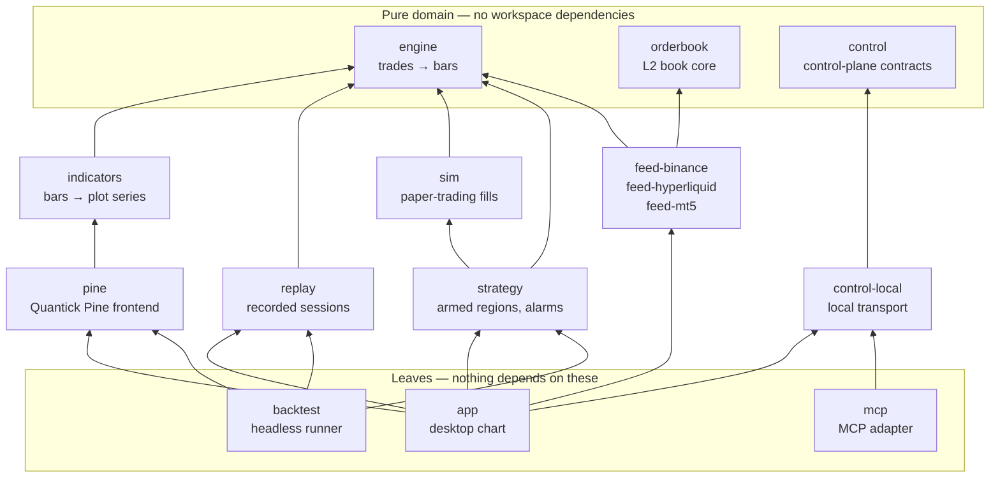

# AGENTS.md — quantick for AI agents

Quantick is a real-time alternative-bar charting engine for order flow trading
(tick / volume / dollar / imbalance bars), written in Rust. One deterministic
engine feeds the chart, the backtest and the bot.

An agent meets this repository in one of two ways, and they are different jobs:

| | You are… | Start here |
| --- | --- | --- |
| **1. Change the code** | editing a Rust workspace | [The map](#the-map) → [Verification loop](#verification-loop-mandatory) → [`CLAUDE.md`](CLAUDE.md) |
| **2. Drive the application** | an MCP client talking to a running Quantick window | [Driving Quantick over MCP](#driving-quantick-over-mcp) |

The second one is the unusual part: **Quantick ships its own MCP server.** The
desktop app is not only a program you can modify — it is a program you can
*operate*, through a versioned capability contract with a consent model, over
a local authenticated transport. The contract, the ADR behind the transport
choice and the threat model are in [`docs/control-plane/`](docs/control-plane/).

---

## Driving Quantick over MCP

`quantick-mcp` is a local STDIO MCP server. It attaches to a Quantick window
that is **already running** with local agent access enabled, authenticates
against that instance's private descriptor, and exposes a tool set whose
ceiling is the profile the trader granted.

```sh
cargo build --release -p quantick-mcp
target/release/quantick-mcp setup --client claude   # or: --client codex
```

`setup` prints the exact registration command for your client, filled in with
the binary's absolute path. It writes no configuration file and embeds no
token. In the app, the trader enables the connection under
**Tools → Local agent access**.

Then call `quantick_describe` first: with no argument it lists the reachable
instances; with an `instance_id` it reports the protocol, the effective
profile and scopes, the registered modules, every capability with its
availability, the snapshot scopes and the limits. The rest of the tool set is
discoverable from that one answer, which is the point — the adapter carries no
hardcoded vocabulary the running instance might not implement.

Three profiles, each a ceiling the trader chooses, each strictly containing
the one below:

| Profile | The connection may… |
| --- | --- |
| `observer` | read: instances, snapshots, closed bars, diagnostics, the semantic scene, the event journal, evidence bundles |
| `annotator` | …and answer on the chart: labels, arrows, zones, toasts and popups, attach and detach a Pine script |
| `cockpit` | …and rearrange the canvas: panes, layout tabs, presets, focus |

A capability the trader did not grant is refused at the gate with
`control.permission_denied`, whatever the connection asked for and whichever
tool it came through — `quantick_invoke` is checked exactly like a named tool.
The surface is 29 capabilities across 19 modules, with 17 snapshot scopes and
25 selectable permissions. The wire schemas are committed under
[`schemas/control/`](schemas/control/) and generated from the Rust contracts,
so a snapshot test rejects undeclared drift.

Two things worth knowing before writing a client:

- **`quantick_wait_for_change` parks instead of polling.** It blocks up to 30 s
  until the event journal moves past your cursor. A trader pressing the mark
  hotkey puts the fully resolved thing under their pointer into that journal —
  so the intended loop is *wait, read the mark, answer about that bar and no
  other*, not "screenshot the window every second and guess".
- **`quantick_get_scene` names what is on screen.** Every control gets an ID
  stable across frames, its owner, whether it is selected, and a coded reason
  when it cannot be operated. The cursor scope answers with the same IDs, so a
  pointer position and the control list refer to the same button. Chart
  canvases report their rectangle in logical points — apply the display scale
  factor yourself before composing them with a screenshot.

The tool-by-tool reference, including how evidence bundles are hashed and what
they admit they do not carry, is in [`crates/mcp/README.md`](crates/mcp/README.md).

---

## The map

A Cargo workspace under `crates/`. The dependency direction is one-way and
enforced by review; never add a reverse edge.



| Crate | What it owns |
| --- | --- |
| `engine` | Raw trades in, alternative bars out. Headless, deterministic, no clock. Everything depends on it; it depends on nothing. |
| `orderbook` | Deterministic local order-book core: validated snapshots, absolute level updates, update-id continuity. |
| `indicators` | The indicator runtime: the `Indicator` trait (commit/preview with rollback), incremental `ta.*` kernels, draw objects, headless host. |
| `pine` | "Quantick Pine" — a Pine v5 subset. Hand-rolled lexer, parser, compile passes and interpreter; zero external dependencies. |
| `replay` | Recorded market-replay sessions: the CSV format, the folder scan, the playback clock. It is *told* how much time passed. |
| `sim` | Deterministic paper trading. Conservative tape-based fills — never on quotes the tape cannot prove. |
| `strategy` | The strategy kernel: armed price regions, projected brackets, the armed-instance state machine, and the `SignalAlarm` beside it. |
| `control` | Transport-neutral control-plane contracts: validated IDs, versioned envelopes, schemas, capability policy, bounded framing, cursors. |
| `control-local` | The local transport: the private instance-descriptor directory and the blocking loopback client. One implementation of the ownership checks serves publisher and client. |
| `mcp` | The MCP adapter. A leaf: it depends on `control` and `control-local` only, never on `app`, and its stdout carries MCP frames only. |
| `feed-*` | Binance, Hyperliquid and MetaTrader 5 sources. They produce trades and never link the script language. |
| `backtest` | The headless harness: recorded sessions in, performance out, over the exact engine and indicator path the chart draws. |
| `app` | The desktop chart (egui). A consumer of the engine, never the other way around. |

Market replay is a **source**, not a chart mode: it releases a recorded
session down the same `FeedEvent` channel a live venue uses, so bars,
navigation and metrics run one code path. UI affordances gate on
`FeedCapabilities`, never on "is this a replay?".

## The four non-negotiables

Summarised here so an agent reading only this file does not violate one.
[`CLAUDE.md`](CLAUDE.md) is authoritative and carries the full list with its
exemptions.

1. **Determinism.** Same trades in → same bars out, always. Inside the engine:
   no wall clock, no randomness, no iteration-order-dependent output.
2. **One engine, three consumers.** Chart, backtest and bot share the
   aggregator. Never fork bar-building logic per consumer.
3. **Data honesty.** Inferred or incomplete data is labelled as such, never
   silently patched. A depth reduction is an "unattributed L2 reduction", not
   a cancellation, because the tape cannot tell which it was.
4. **Operable without a hand.** A capability never ships reachable by mouse
   alone: it gets a named call, a readable result and a registry entry. This
   is why the control plane above exists.

Everything written into a tracked file is English — identifiers, comments, UI
strings, test names, commit messages. `crates/app/tests/language_guard.rs`
enforces the mechanical half.

## Verification loop (mandatory)

All four must pass before every commit. CI enforces the same four.

```sh
cargo fmt --all -- --check
cargo clippy --workspace --all-targets -- -D warnings
cargo build --workspace
cargo test --workspace
```

Two more the workspace cannot see, needed when you touch `tools/mt5/` or
`bridge/mt5/` — they are Python, and cargo never compiles them:

```sh
ruff check --select F tools/mt5/ bridge/mt5/
python3 tools/mt5/test_export_session.py
```

## Where the documentation is

[`docs/README.md`](docs/README.md) indexes the whole tree. The entries an agent
reaches for most often:

- [`docs/control-plane/`](docs/control-plane/) — the control contract, ADR
  0001, the observer threat model, the capability inventory
- [`docs/pine-dialect.md`](docs/pine-dialect.md) — the Quantick Pine reference
- [`docs/agentic-development.md`](docs/agentic-development.md) — how this
  repository is built *by* agents: the skills, the review gates, and the hooks
  that enforce them
- [`CLAUDE.md`](CLAUDE.md) — the working rules, authoritative
- [`CONTRIBUTING.md`](CONTRIBUTING.md) — the human contribution workflow
