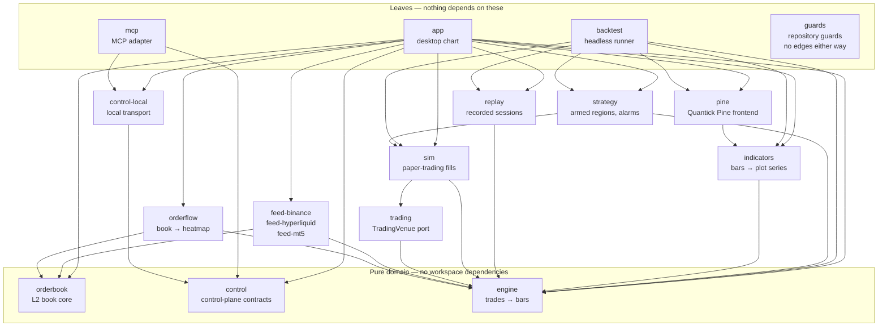

# AGENTS.md — quantick for AI agents

Quantick is a real-time alternative-bar charting engine for order flow trading
(tick / volume / dollar / imbalance bars), written in Rust. One deterministic
engine feeds the chart, the backtest and the bot.

An agent meets this repository in one of two ways, and they are different jobs:

| | You are… | Start here |
| --- | --- | --- |
| **1. Change the code** | editing a Rust workspace | [The map](#the-map) → [Verification loop](#verification-loop-mandatory) → [`CLAUDE.md`](CLAUDE.md) |
| **2. Drive the application** | an MCP client talking to a running Quantick window | [Driving Quantick over MCP](#driving-quantick-over-mcp) |

The second one is the unusual part: **Quantick ships its own MCP server.** The
desktop app is not only a program you can modify — it is a program you can
*operate*, through a versioned capability contract with a consent model, over
a local authenticated transport. The contract, the ADR behind the transport
choice and the threat model are in [`docs/control-plane/`](docs/control-plane/).

---

## Driving Quantick over MCP

`quantick-mcp` is a local STDIO MCP server. It attaches to a Quantick window
that is **already running** with local agent access enabled, authenticates
against that instance's private descriptor, and exposes a tool set whose
ceiling is the profile the trader granted.

```sh
cargo build --release -p quantick-mcp
target/release/quantick-mcp setup --client claude   # or: --client codex
```

`setup` only prints the registration command for your client, filled in with
the binary's absolute path — it reads nothing but its own path, so it works
before Quantick is running. It writes no configuration file and embeds no
token. Register the command it prints, then, in the app, enable the connection
under **Tools → Local agent access** and pick the scopes it gets.

Then call `quantick_describe` first: with no argument it lists the reachable
instances; with an `instance_id` it reports the protocol, the effective
profile and scopes, the registered modules, every capability with its
availability, the snapshot scopes and the limits. The rest of the tool set is
discoverable from that one answer, which is the point — the adapter carries no
hardcoded vocabulary the running instance might not implement.

### Profiles

The contract declares four, chained so each inherits the one before it —
`observer` → `annotator` → `cockpit` → `trader`. Only the first three are
reachable today, and the adapter only ever asks for those.

| Profile | The connection may… |
| --- | --- |
| `observer` | read: instances, snapshots, closed bars, diagnostics, the semantic scene, the event journal, evidence bundles |
| `annotator` | …and answer on the chart: labels, arrows, zones, toasts and popups, attach and detach a Pine script |
| `cockpit` | …and rearrange the canvas (panes, layout tabs, presets, focus) **and reconnect the market feed** |
| `trader` | place, bracket and cancel orders. Its `trade` permission is marked sensitive with `default_grant: Denied`, the access panel filters it out, and `quantick-mcp` never requests it — so no connection reaches it today. It exists so the day fills are not simulated, nothing has to be re-decided in a hurry. |

Two boundaries inside `cockpit` are worth stating precisely, because "cockpit
just moves panes" is the comfortable reading and it is wrong:

- The `cockpit` permission alone unlocks `feed.reconnect`, which respawns the
  live market transport. The layout capabilities need `cockpit.layout` on top.
- `feed.reload` needs the additional, separately-marked-sensitive
  `cockpit.recover`. It declares `reversible: false` and the risk flag
  `timeline_rebuilt`, and it closes any open paper position and disarms every
  strategy. `quantick-mcp` requests only `cockpit` and `cockpit.layout`, so an
  MCP connection cannot reach it — but the capability is in the registry, and
  a client that asked for the scope by hand would be a different question.

A capability the trader did not grant is refused at the gate with
`control.permission_denied`, whatever the connection asked for and whichever
tool it came through — `quantick_invoke` is checked exactly like a named tool.

As [`schemas/control/observer-capability-catalog-v1.json`](schemas/control/observer-capability-catalog-v1.json)
records it, the surface is **34 capabilities across 20 modules, with 17
snapshot scopes and 27 selectable permissions**. Recount from that file rather
than trusting this sentence: the schemas are generated from the Rust contracts
and guarded by a snapshot test, but this prose is hand-typed and has no guard.

### Two things worth knowing before writing a client

- **`quantick_wait_for_change` parks instead of polling.** It blocks up to 30 s
  until the event journal moves past your cursor. A trader pressing the mark
  hotkey puts the fully resolved thing under their pointer into that journal —
  so the intended loop is *wait, read the mark, answer about that bar and no
  other*, not "screenshot the window every second and guess".
- **`quantick_get_scene` names what is on screen.** Every control gets an ID
  stable across frames, its owner, whether it is selected, and a coded reason
  when it cannot be operated. The cursor scope answers with the same IDs, so a
  pointer position and the control list refer to the same button. Chart
  canvases report their rectangle in logical points — apply the display scale
  factor yourself before composing them with a screenshot.

The tool-by-tool reference, including how evidence bundles are hashed and what
they admit they do not carry, is in [`crates/mcp/README.md`](crates/mcp/README.md).

---

## The map

A Cargo workspace under `crates/`. The dependency direction is one-way,
enforced by `crates/pine/tests/workspace_deps.rs`; never add a reverse edge.
An arrow reads *depends on*.



| Crate | What it owns |
| --- | --- |
| `engine` | Raw trades in, alternative bars out. Headless, deterministic, no clock. Everything depends on it; it depends on nothing. |
| `orderbook` | Deterministic local order-book core: validated snapshots, absolute level updates, update-id continuity. |
| `orderflow` | The order-flow engine: liquidity history, grouping, timeline and the settled/live heatmap projections. Headless; its caller passes it the clock. The chart draws it today, `backtest` may consume it next. |
| `indicators` | The indicator runtime: the `Indicator` trait (commit/preview with rollback), incremental `ta.*` kernels, draw objects, headless host. |
| `pine` | "Quantick Pine" — a Pine v5 subset. Hand-rolled lexer, parser, compile passes and interpreter; zero external dependencies. |
| `replay` | Recorded market-replay sessions: the CSV format, the folder scan, the playback clock. It is *told* how much time passed. |
| `trading` | The venue-neutral order vocabulary and the `TradingVenue` port every execution backend implements, so a broker adapter docks where the paper simulator sits. |
| `sim` | Deterministic paper trading: one implementation of `TradingVenue`. Conservative tape-based fills — never on quotes the tape cannot prove. |
| `strategy` | The strategy kernel: armed price regions, projected brackets, the armed-instance state machine, and the `SignalAlarm` beside it. |
| `control` | Transport-neutral control-plane contracts: validated IDs, versioned envelopes, schemas, capability policy, bounded framing, cursors, and the `fake` host/client ports, published on purpose rather than test-only. |
| `control-local` | The local transport: the private instance-descriptor directory and the blocking loopback client. One implementation of the ownership checks serves publisher and client. |
| `mcp` | The MCP adapter. A leaf: it depends on `control` and `control-local` only, never on `app`, and its stdout carries MCP frames only. |
| `feed-*` | Binance, Hyperliquid and MetaTrader 5 sources. They produce trades and never link the script language. |
| `backtest` | The headless harness: recorded sessions in, performance out, over the exact engine and indicator path the chart draws. |
| `guards` | The guards the compiler cannot see: the size, context and cycle ratchets, the English scan, the encoding check. No dependencies, so asking them costs a second. |
| `app` | The desktop chart (egui). A consumer of the engine, never the other way around. |

## The non-negotiable design rules

Named here so an agent reading only this file does not violate one.
[`CLAUDE.md`](CLAUDE.md) states them and is authoritative; where this summary
and that file differ, that file wins.

1. **Determinism.** Same trades in → same bars out, always. Inside the engine:
   no wall clock, no randomness, no iteration-order-dependent output.
2. **One engine, three consumers.** Chart, backtest and bot share the
   aggregator. Never fork bar-building logic per consumer.
3. **Data honesty.** Inferred or incomplete data is labelled as such, never
   silently patched. A depth reduction is an "unattributed L2 reduction", not
   a cancellation, because the tape cannot tell which it was.
4. **English is the repository's language.** `CLAUDE.md` is the rule's single
   owner — it defines the scope and the four exemptions where the foreign text
   *is* the data. Read it there; this file deliberately does not restate it,
   and `crates/guards/src/language.rs` enforces the mechanical half.
5. **Small and focused.** This is not a trading platform. Build bars, show
   bars, expose bars to code. This is the rule that refuses scope creep, and
   it applies to the control plane above as much as to the chart.
6. **Operable without a hand.** A capability never ships reachable by mouse
   alone: it gets a named call, a readable result and a registry entry. This
   is why the control plane exists.

## Verification loop (mandatory)

All four must pass before every commit. CI enforces the same four.

```sh
cargo fmt --all -- --check
cargo clippy --workspace --all-targets
cargo build --workspace
cargo test --workspace
```

CI runs five more steps that `cargo` cannot see. Run the ones your change
touches — the Python is never compiled by the workspace, so an undefined name
there ships silently:

```sh
sh .claude/hooks/guardrails_test.sh          # the agent guardrails' own tests
ruff check --select F tools/mt5/ bridge/mt5/ # when you touch either folder
python3 tools/mt5/test_export_session.py     # the session exporter
python3 bridge/mt5/tests/test_paging.py      # the MT5 bridge's candle paging
cargo deny check bans licenses               # when Cargo.lock moves
```

## Where the documentation is

[`docs/README.md`](docs/README.md) indexes the tree. The entries an agent
reaches for most often:

- [`docs/control-plane/`](docs/control-plane/) — the control contract, ADR
  0001, the observer threat model, the capability inventory
- [`docs/pine-dialect.md`](docs/pine-dialect.md) — the Quantick Pine reference
- [`docs/agentic-development.md`](docs/agentic-development.md) — how this
  repository is built *by* agents: the skills, the review gates, and the hooks
  that enforce them
- [`CLAUDE.md`](CLAUDE.md) — the working rules, authoritative
- [`CONTRIBUTING.md`](CONTRIBUTING.md) — the human contribution workflow
