# AGENTS.md — quantick for AI agents

Quantick builds real-time alternative bars (tick / volume / dollar / imbalance)
in Rust; one deterministic engine feeds the chart, backtest and bot.

| | You are… | Start here |
| --- | --- | --- |
| **1. Change the code** | editing the Rust workspace | [The map](#the-map) → [Verification loop](#verification-loop-mandatory) → [`CLAUDE.md`](CLAUDE.md) |
| **2. Drive the application** | an MCP client at a running Quantick window | [Driving Quantick over MCP](#driving-quantick-over-mcp) |

**Quantick ships an MCP server.** Operate the desktop app through its versioned
capability contract, consent model and local authenticated transport;
[`docs/control-plane/`](docs/control-plane/) holds the contract, transport ADR
and threat model.

---

## Driving Quantick over MCP

`quantick-mcp` is a local STDIO server for an **already-running** window with
local agent access enabled; it authenticates with the private instance
descriptor and cannot exceed the trader-granted profile.

```sh
cargo build --release -p quantick-mcp
target/release/quantick-mcp setup --client claude   # or: --client codex
```

`setup` only prints your client's registration command with the binary's
absolute path; it reads nothing else, writes no config, embeds no token.
Register what it prints, then enable the connection under **Tools → Local
agent access** and pick its scopes.

Then call `quantick_describe` first: with no argument it lists the reachable
instances; with an `instance_id` it reports the protocol, the effective
profile and scopes, the registered modules, every capability with its
availability, snapshot scopes and limits. That response is the vocabulary.

### Profiles

The contract declares four, each inheriting the one before —
`observer` → `annotator` → `cockpit` → `trader`. Only the first three are
reachable today, and the adapter only ever asks for those.

| Profile | The connection may… |
| --- | --- |
| `observer` | read: instances, snapshots, closed bars, diagnostics, the scene, the event journal, evidence bundles |
| `annotator` | …and answer on the chart: labels, arrows, zones, toasts, popups, attach or detach a Pine script |
| `cockpit` | …and rearrange the canvas (panes, layout tabs, presets, focus) **and reconnect the feed** |
| `trader` | place, bracket and cancel orders. Its `trade` permission is sensitive with `default_grant: Denied`, the access panel filters it out and `quantick-mcp` never requests it, so no connection reaches it today; it exists so that the day fills are real, nothing is decided in a hurry. |

Two boundaries inside `cockpit`, because "cockpit just moves panes" is the
comfortable reading and it is wrong:

- The `cockpit` permission alone unlocks `feed.reconnect`, which respawns the
  live market transport; the layout capabilities need `cockpit.layout` too.
- `feed.reload` needs the separately-marked-sensitive `cockpit.recover`. It
  declares `reversible: false` and the risk flag `timeline_rebuilt`, closes any
  open paper position and disarms every strategy. `quantick-mcp` requests only
  `cockpit` and `cockpit.layout`, so an MCP connection cannot reach it — but
  it is in the registry, and a client asking for the scope by hand is a
  different question.

A capability the trader did not grant is refused at the gate with
`control.permission_denied`, whatever the connection asked for and whichever
tool it came through — `quantick_invoke` is checked like a named tool.

The generated [capability inventory](docs/control-plane/capability-inventory.md)
lists capability IDs, versions, modules and required permissions; the
generated [capability catalog](schemas/control/observer-capability-catalog-v1.json)
adds profiles, selectable permissions and snapshot scopes. Both are checked
against their generators; `quantick_describe` is the live surface.

### Two things to know before writing a client

- **`quantick_wait_for_change` parks instead of polling.** It blocks up to 30 s
  until the event journal moves past your cursor. The mark hotkey puts what is
  under the trader's pointer into that journal — so the loop is *wait, read
  the mark, answer about that bar*, not "screenshot every second and guess".
- **`quantick_get_scene` names what is on screen.** Every control gets an ID
  stable across frames, its owner, whether it is selected, and a coded reason
  when it cannot be operated. The cursor scope answers with the same IDs, so a
  pointer position and the control list refer to the same button. Chart
  canvases report their rectangle in logical points — apply the display scale
  before composing them with a screenshot.

The tool reference, evidence hashing and limitations: [`crates/mcp/README.md`](crates/mcp/README.md).

---

## The map

`crates/` workspace; arrows mean *depends on*; [graph guard](crates/guards/src/graph.rs) forbids reverse edges.

```mermaid
graph TD
  subgraph leaves["Leaves — nothing depends on these"]
    app["app<br/>desktop chart"]
    backtest["backtest<br/>headless runner"]
    mcp["mcp<br/>MCP adapter"]
    guards["guards<br/>repository guards<br/>no edges either way"]
  end

  app --> anchoredstudies
  app --> backpressure
  app --> chart
  app --> stores
  app --> workspace
  app --> session["indicator-session"]
  session --> pine & indicators & engine
  app --> pine
  app --> indicators
  app --> strategy
  app --> sim
  app --> paper
  app --> civil
  app --> replay
  app --> orderbook
  app --> orderflow
  app --> feed
  app --> control
  app --> controllocal
  app --> controlhost
  app --> engine
  app --> chartinteraction
  app --> layers
  backtest --> strategy
  backtest --> pine
  backtest --> indicators
  backtest --> replay
  backtest --> sim
  backtest -.-> paper
  backtest --> engine
  app --> operability
  mcp --> controllocal
  mcp --> control

  chart["chart<br/>headless chart model"] --> engine & indicators & orderflow
  stores["stores<br/>cockpit documents"] --> chart & feed & workspace
  anchoredstudies["anchored-studies"] --> engine
  anchoredstudies --> indicators
  pine["pine<br/>Quantick Pine frontend"] --> indicators
  strategy["strategy<br/>armed regions, alarms"] --> sim
  strategy --> engine
  controllocal["control-local<br/>local transport"] --> control
  controlhost["control-host<br/>host machinery"] --> control
  indicators["indicators<br/>bars → plot series"] --> engine
  replay["replay<br/>recorded sessions"] --> engine & civil
  paper["paper<br/>paper account"] --> sim
  paper --> engine
  paper --> civil
  paper --> replay
  sim["sim<br/>paper-trading fills"] --> trading
  sim --> engine
  trading["trading<br/>TradingVenue port"] --> engine
  feed["feed<br/>feed host"] --> feeds
  feed --> replay
  feed --> orderbook
  feed --> engine
  feeds["feed-binance<br/>feed-hyperliquid<br/>feed-mt5"] --> engine
  feeds --> orderbook
  orderflow["orderflow<br/>book → heatmap"] --> engine
  orderflow --> orderbook

  subgraph pure["Pure domain — no workspace dependencies"]
    operability["operability<br/>behaviour table"]
    backpressure["backpressure<br/>worker admission"]
    chartinteraction["chart-interaction<br/>interaction owners"]
    layers["layers<br/>visibility policy"]
    engine["engine<br/>trades → bars"]
    orderbook["orderbook<br/>L2 book core"]
    control["control<br/>control-plane contracts"]
    civil["civil<br/>civil dates"]
  end
```



| Crate | What it owns |
| --- | --- |
| `backpressure` | Bounded admission between an owner and its worker — park, fold, count, never drop — and the progress counts; told the time. |
| `chart` | Headless chart model: `ChartState` over the engine, price geometry, viewport, candle style, live strip. |
| `stores` | The cockpit's documents: feed catalogue, symbols, footprint, bubble and indicator presets, window arrangement; the window resolves each path. |
| `chart-interaction` | Headless quick-range owner, scoped commands/events/effects and exact anchors. |
| `layers` | Headless layer catalog, requested visibility, availability, inheritance and persistence policy; typed effects keep feature owners. |
| `anchored-studies` | Resumable profile and anchored-average state; the caller schedules and paints. |
| `workspace` | Layout documents and pane membership transitions. |
| `engine` | Raw trades in, alternative bars out. Headless, deterministic, no clock, no dependencies. |
| `orderbook` | Deterministic order-book core: validated snapshots, absolute level updates, update-id continuity. |
| `orderflow` | Liquidity history, grouping, timeline, settled/live heatmap projections. Headless; told the time. |
| `indicator-session` | Headless source binding, batches, deltas. |
| `indicators` | Headless host, `Indicator` commit/preview rollback, incremental `ta.*`, draw objects. |
| `pine` | Pine v5 subset: hand-rolled lexer, parser, compile passes, interpreter; no dependencies. |
| `replay` | Recorded sessions: the CSV format, the folder scan, the deal recorder, the playback clock; *told* the time. |
| `feed` | `FeedEvent`/`FeedCommand` port; Binance, Hyperliquid, MetaTrader, bridge, replay and stall adapters; feed config, history reach, session export. Owns runtimes, threads and clock below `app`. |
| `trading` | The venue-neutral order vocabulary and the `TradingVenue` port every execution backend implements; a broker adapter docks where the simulator sits. |
| `sim` | Deterministic paper trading: one `TradingVenue`. Conservative tape-based fills — never on quotes the tape cannot prove. |
| `paper` | The paper account: orders, risk sizing, the journal, its home and sidecar, report numbers over a `sim` venue. |
| `civil` | Civil dates and the display offset: one date law for journal, report and chart axis. |
| `strategy` | The strategy kernel: armed regions, brackets, the armed-instance state machine, its `SignalAlarm`, alarm sounds, the preset bank. |
| `control` | Transport-neutral contracts: validated IDs, versioned envelopes, schemas, capability policy, bounded framing, cursors, `fake` host/client ports. |
| `control-local` | The local transport: the private instance-descriptor directory and the blocking loopback client; one ownership check serves publisher and client. |
| `control-host` | Host machinery under `app`: projection registry, admission, idempotency store, event journal. Told the time. |
| `operability` | Every supported UI behaviour, the capability reaching it or its recorded exclusion; the matrix and the drift check. |
| `mcp` | The MCP adapter. A leaf over `control` and `control-local`, never `app`; stdout carries MCP frames only. |
| `feed-*` | Binance, Hyperliquid and MetaTrader 5 sources: trades out, never the script language. |
| `backtest` | The headless harness: recorded sessions in, performance out, over the chart's exact engine and indicator path. |
| `guards` | Guards the compiler cannot see: the size, context, cycle and UI-free ratchets, the English and encoding scans. |
| `app` | Desktop chart (egui), engine consumer, transport. |

## The non-negotiable design rules

[`CLAUDE.md`](CLAUDE.md) states them and is authoritative; where this summary
and that file differ, that file wins.

1. **Determinism.** Same trades in → same bars out, always. In the engine: no
   wall clock, no randomness, no iteration-order-dependent output.
2. **One engine, three consumers.** Chart, backtest and bot share the
   aggregator; never fork bar-building per consumer.
3. **Data honesty.** Inferred or incomplete data is labelled, never silently
   patched. A depth reduction is an "unattributed L2 reduction", not a
   cancellation: the tape cannot tell.
4. **English is the repository's language.** `CLAUDE.md` is the rule's single
   owner — scope and the four exemptions where the foreign text *is* the
   data. `crates/guards/src/language.rs` enforces the mechanical half.
5. **Small and focused.** Not a trading platform. Build bars, show bars,
   expose bars to code; refuse scope creep, in the control plane as much as
   in the chart.
6. **Operable without a hand.** A capability never ships reachable by mouse
   alone: a named call, a readable result, a registry entry. This is why the
   control plane exists.

## Verification loop (mandatory)

Code: all four. Prose/reuse: `CLAUDE.md`'s delivery contract.
Final-head CI: all four.

```sh
cargo fmt --all -- --check
cargo clippy --workspace --all-targets
cargo build --workspace
cargo test --workspace
```

CI runs five more steps that `cargo` cannot see. Run the ones your change
touches — nothing compiles the Python, so an undefined name there ships
silently:

```sh
sh .claude/hooks/guardrails_test.sh          # the agent guardrails' own tests
ruff check --select F tools/mt5/ bridge/mt5/ # when you touch either folder
python3 tools/mt5/test_export_session.py     # the session exporter
python3 bridge/mt5/tests/test_paging.py      # the MT5 bridge's candle paging
cargo deny check bans licenses               # when Cargo.lock moves
```

## Where the documentation is

[`docs/README.md`](docs/README.md) indexes the tree. The entries agents reach
for most:

- [`docs/control-plane/`](docs/control-plane/) — the control contract, ADR
  0001, the threat model, the capability inventory
- [`docs/pine-dialect.md`](docs/pine-dialect.md) — the Quantick Pine reference
- [`docs/agentic-development.md`](docs/agentic-development.md) — how this
  repository is built *by* agents: the skills, review gates and hooks
- [`CLAUDE.md`](CLAUDE.md) — the working rules, authoritative
- [`CONTRIBUTING.md`](CONTRIBUTING.md) — the human workflow
