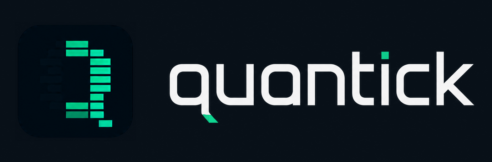
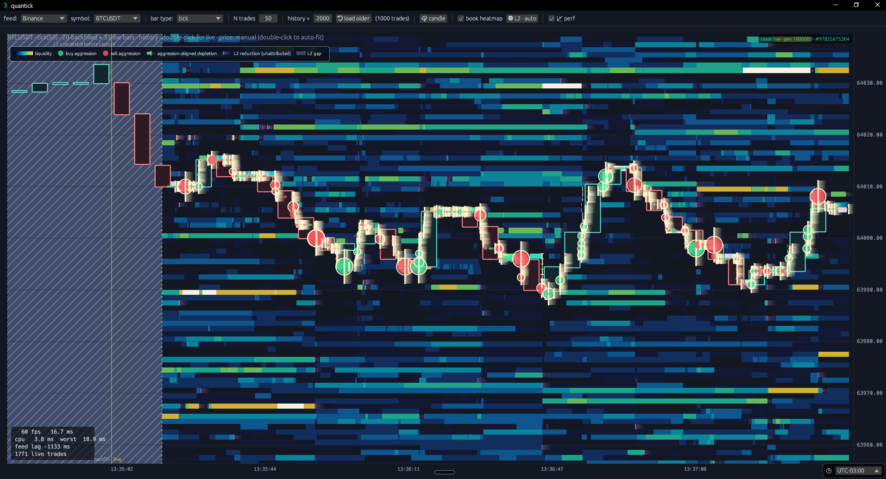

<p align="center">
  
</p>

# quantick

**Real-time alternative bar charts for order flow trading — and one engine to take your research from chart to backtest to bot.**

<p align="center">
  
</p>

<p align="center"><em>Live BTCUSDT tick bars over the Bookmap-inspired L2 liquidity heatmap, with buy/sell aggression bubbles and a real-time performance HUD — this is <code>cargo run -p quantick-app</code> out of the box.</em></p>

> ⚠️ Early development, but already runnable. The Rust bar engine, the live Binance feed and the native desktop chart work today — you can clone, build and watch bars form in real time in a few minutes (see [Quick start](#quick-start--build-test-run)). APIs will still churn. Star/watch the repo to follow along.

## Why this exists

Time-based candles distort order flow. A 1-minute bar at the session open and a 1-minute bar during lunch look identical on your chart, yet one may contain fifty times more trading than the other. Every indicator you compute on top inherits that distortion: a delta of +500 contracts means one thing in a quiet bar and something completely different in a busy one.

The fix has been known for decades: sample by **activity** instead of time. Close a bar every N trades (tick bars), every N contracts (volume bars), every $N of notional (dollar bars), or whenever buying/selling pressure gets unusually one-sided (imbalance bars). The research literature — from Ané & Geman (2000) to López de Prado's *Advances in Financial Machine Learning* — documents why this works: activity-sampled bars have far better statistical properties, and they make flow metrics comparable from bar to bar.

**Quant funds and professional desks use these bar types every day.** But the tooling has stayed locked up: it lives inside proprietary platforms (Bookmap, ATAS, Sierra Chart, NinjaTrader) that don't expose an engine you can program against, or inside private codebases that never see daylight. If you want to watch these bars form live on a chart — and then hand the *exact same bars* to a backtest or a trading bot — there is essentially no open-source option today.

quantick exists to change that: **a free, open, programmable implementation of the charts professionals actually use, built for the community.**

## What quantick is for

1. **Visualize.** A native desktop app that renders tick, volume, dollar and imbalance bars from a live market feed — with per-bar delta and CVD built in. See the market the way flow traders read it.
2. **Research.** Study setups directly on the charts: how does absorption look on volume bars? Where does CVD diverge? Chart-driven analysis is where strategy ideas are born.
3. **Build.** The same engine that draws your chart feeds your backtests and your bots. The bars your strategy trades live are byte-identical to the bars you researched and backtested — parity by construction, not by discipline.

## Quick start — build, test, run

You don't need an exchange account, an API key or any credentials. Out of the box the chart connects to Binance's **public** market data and opens on `BTCUSDT`.

### 1. Install Rust

quantick is pure Rust. Install a recent stable toolchain with [rustup](https://rustup.rs/) — you need **Rust 1.85 or newer** (the workspace is on the 2024 edition):

```sh
# macOS / Linux
curl --proto '=https' --tlsv1.2 -sSf https://sh.rustup.rs | sh
# Windows: download and run rustup-init.exe from https://rustup.rs

rustc --version   # expect 1.85.0 or newer
```

### 2. Clone and build

```sh
git clone https://github.com/milocaetano/quantick.git
cd quantick
cargo build --workspace
```

The first build compiles every dependency and takes a few minutes; later builds are incremental and fast.

### 3. Run the tests

The engine is developed test-first and guarded by golden/snapshot tests (fixed trades in → known bars out). Run the whole suite with:

```sh
cargo test --workspace
```

### 4. Run the chart

```sh
cargo run -p quantick-app
```

A native window titled **quantick** opens, backfills recent history over REST and then streams live trades, forming bars as they happen. From the controls bar you can switch the **bar type** live — tick, volume, dollar, time or imbalance — and tune its parameter. For the smoothest rendering on a busy order book, build optimized:

```sh
cargo run --release -p quantick-app
```

> The chart is a native desktop app (egui) and needs a graphical display; it won't run on a headless server. It's tested on Windows, Linux and macOS.

### 5. (Optional) Pick a different feed or symbol

Feeds and symbols are configuration, never hardcoded. To change what the chart opens on, drop a `quantick.toml` in the working directory (it's git-ignored, so it stays local) or point `QUANTICK_CONFIG` at any TOML file. For example, to open on Ethereum:

```toml
# quantick.toml
default_feed = "binance"
default_symbol = "ETHUSDT"

[[feeds]]
id = "binance"
name = "Binance"
provider = "binance"
symbols = ["BTCUSDT", "ETHUSDT"]
```

The full set of options — available feeds, the optional MetaTrader 5 bridge, the L2 heatmap toggles and logging — is documented in [`crates/app/config/feeds.toml`](crates/app/config/feeds.toml) and in the [L2 liquidity map](#optional-l2-liquidity-map) section below.

### Contributing

Working on the code? Every change must pass the four-check verification loop (`cargo fmt --all -- --check`, `cargo clippy --workspace --all-targets -- -D warnings`, `cargo build --workspace`, `cargo test --workspace`) before commit — the same checks CI enforces. See [CONTRIBUTING.md](CONTRIBUTING.md) for the full workflow.

## Candle appearance

Open **🎨 candle** from the chart toolbar to tune candle rendering without
changing bars, feeds or order-book capture. The default **Order flow** preset
uses a low-opacity body and a strong directional outline so liquidity and
aggression remain visible.

- Presets: **Order flow**, **Glass**, **Outline only** and **Classic**.
- Independent bull/bear colours for the body fill and outline.
- Body fill opacity, outline opacity/thickness, body width, corner radius and
  minimum doji height.
- Optional wicks with directional or custom colour, opacity and thickness.
- A forming-candle opacity control.
- **Outline only** removes the candle body fill entirely; this is the clearest
  mode for dense heatmaps.
- Canvas background and grid can be recoloured, faded or disabled independently.

The settings window includes a live preview. Candle paint is intentionally
layered after resting liquidity and before aggression bubbles:
`heatmap → candle → aggression`. Appearance changes only trigger a redraw and
never restart the market-data pipelines.

## Optional L2 liquidity map

The chart can capture Binance Spot level-2 order-book depth and render a
Bookmap-inspired liquidity map. It is **disabled by default** and must be
enabled from the chart controls. The **⚙ L2** panel includes a deterministic
preview of every visual state, so themes and grouping can be tuned without
waiting for a rare live-book event.

The visualization follows a few data-honesty rules:

- History begins at the first successfully synchronized live snapshot/update sequence. Binance does not provide historical L2 backfill through this feed, so candles before that point are marked as unavailable instead of being reconstructed.
- Depth update IDs are checked continuously. A disconnect, sequence gap or resynchronization closes the current liquidity runs, marks the affected interval with subtle shading and dashed vertical boundaries, and starts again from a fresh snapshot. Stale book state is never stretched across a gap.
- Heatmap quantities are resting bid/ask amounts from the snapshot plus absolute depth updates, limited to the configured number of price levels on each side. Liquidity outside that coverage is unknown.
- A displayed band records the bucket total observed when its run opened; changes smaller than ~10% merge into the open run instead of cutting a new one. This churn-merge tolerance is a disclosed granularity choice — larger moves, appearances and full removals always cut a new run at their exact value.
- `aggTrade` bubbles are confirmed market aggression. Their area is quantity-proportional and nearby prints can be clustered without changing total volume.
- A dark **bite** and impact ring mean an aggression and an L2 reduction were compatible in passive side, displayed price range, synchronized generation and time. This is an association, not a claim that one event caused the other.
- A violet dashed tail means displayed liquidity decreased without compatible aggression. It is deliberately called an **unattributed L2 reduction**, not a cancellation: a depth reduction can be an execution, cancellation, replacement or a combination of those events.
- Window clipping, retention boundaries, snapshots and synchronization gaps never create fake reduction markers.
- Captured history is bounded and kept in memory only. Restarting the application starts a new capture.

The chart exposes these settings:

| Setting | Default | Range / behavior |
| --- | ---: | --- |
| L2 heatmap | Off | Starts live capture when enabled |
| Retention | 30 minutes | 1–1,440 minutes |
| Display range | Auto / 128 rows | Native, `2×`, `5×`, `10×`, `25×`, `50×`, custom multiple or adaptive-to-zoom; changing it reprojects immediately without resetting history |
| Base capture bucket | auto from price | Sized to ~`price / 65000` (1/2/5·10^k) on the first snapshot; any positive value can be set by hand. Changing the base resolution requires a fresh snapshot and resets retained L2 history |
| Theme | Bookmap | Bookmap, High contrast or Color blind |
| Brightness | `0.9` | `0.05`–`1.0` |
| Quiet liquidity curve | `1.8` | `0.25`–`2.0`; above one sinks quiet liquidity into the dark canvas so only real walls glow |
| Intensity scale | Visible P99 | Automatic visible-window P99 or a fixed full-intensity quantity |
| Aggression bubbles | On | Can be hidden independently of the heatmap |
| Bubble clustering | 200 ms | Raw, 50, 100, 200 or 500 ms |
| Liquidity response | On / 250 ms | Bite or withdrawal-tail markers with a configurable 25–1,000 ms evidence window |
| Legend | On | Explains liquidity brightness, buy/sell aggression, aligned depletion, unattributed reduction and L2 gaps |

The in-memory safety budgets are 500,000 liquidity runs (approximately 64 MiB), 100,000 aggression records, 12,000 projected visible cells/events and 700 projected bubbles. Old history is pruned and excess render primitives are dropped within those limits; the associated counters are emitted in diagnostic logs. All book state lives on a dedicated thread: the UI forwards depth events and latest-wins projection requests through a channel and only draws the newest published frame, so a dense-book projection can never block a frame. Projections rebuild at the ~220 ms depth cadence, are regrouped in a deterministic sweep and submitted in batched meshes. The paint order is `gap → heatmap → liquidity response → candle → aggression → legend`.

### L2 and logging environment variables

| Variable | Default | Behavior |
| --- | --- | --- |
| `QUANTICK_BOOK_DEPTH` | `1000` | Binance snapshot depth per side. Numeric values are clamped to `1`–`5000`; a missing or invalid value uses the default. Higher values increase initial REST payload, synchronization work and memory use. |
| `QUANTICK_BOOK_AUTOSTART` | unset | Set to `1` to enable L2 capture on startup without clicking the chart toggle (development/ops convenience; same code path as the toggle). |
| `QUANTICK_LOG_FORMAT` | `text` | Set to `json` for newline-delimited JSON diagnostic logs on stderr. |
| `RUST_LOG` | `quantick=info` | Standard tracing filter; for example, use `quantick=debug` for deeper diagnostics. |

JSON logs include stable fields such as `schema_version`, `event_code`, symbol, connection generation, update IDs, recovery action and health counters so synchronization and coverage gaps can be investigated without inferring state from prose.

## Who it's for

- **Flow traders** who want professional bar types without platform lock-in
- **Bot developers** who need deterministic, programmable bar construction for strategies driven by order flow
- **Quant researchers** who want reproducible activity-sampled bars for backtesting and ML feature engineering

## Architecture

The project is a Cargo workspace of small, one-way-dependent crates (`app` / `feed-*` → `engine` / `orderbook`). Status today:

- **Bar engine (Rust)** — ✅ raw trades in → alternative bars out; deterministic and headless, usable with no UI attached (`crates/engine`)
- **Live feeds** — ✅ Binance aggTrades over public data, works out of the box with no API key (`crates/feed-binance`); ✅ MetaTrader 5 via a local bridge EA (`crates/feed-mt5`)
- **Desktop app** — ✅ native chart (egui) showing bars form in real time, with a Bookmap-inspired L2 liquidity heatmap (`crates/app`)
- **Bindings** — ⏳ Python bindings and a C API are planned, so the engine plugs into existing backtest stacks and bots in any language

## Design principles

1. **One engine, three consumers.** Chart, backtest and bot consume the same aggregator. Live/backtest divergence is a bug class we design out, not test out.
2. **Deterministic.** Same trades in, same bars out. Always.
3. **Data honesty.** Inferred or incomplete data is labeled, never silently patched.
4. **Small and focused.** This is not a trading platform. It builds and shows bars, and exposes them to your code. That's the job.

## Roadmap

- [x] Core bar engine (tick / volume / dollar / time bars)
- [x] Binance aggTrades feed
- [x] Desktop chart
- [x] Imbalance bars (López de Prado information-driven sampling)
- [x] MetaTrader 5 feed
- [x] Bookmap-inspired L2 liquidity heatmap (egui/glow; wgpu migration still open)
- [ ] CVD & delta visuals (engine already stores per-bar buy/sell volume and delta; charting them is next)
- [ ] Python bindings
- [ ] C API, so bots in C++ (or any language) can consume the engine

## Contributing

The whole point of this project is to open up tooling that has historically been private. Ideas, use cases and design discussion are welcome right now — [start a discussion](https://github.com/milocaetano/quantick/discussions), even before there's code to review. Ready to contribute code? See [CONTRIBUTING.md](CONTRIBUTING.md) for the workflow.

## License

MIT
