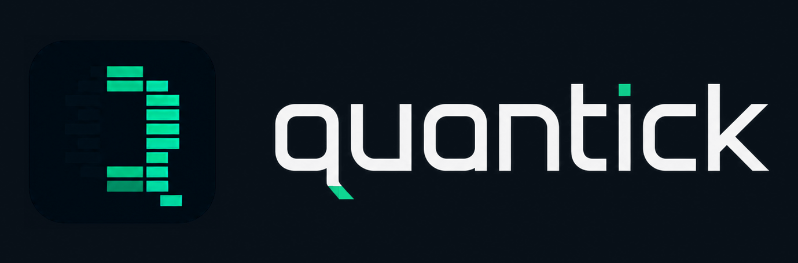
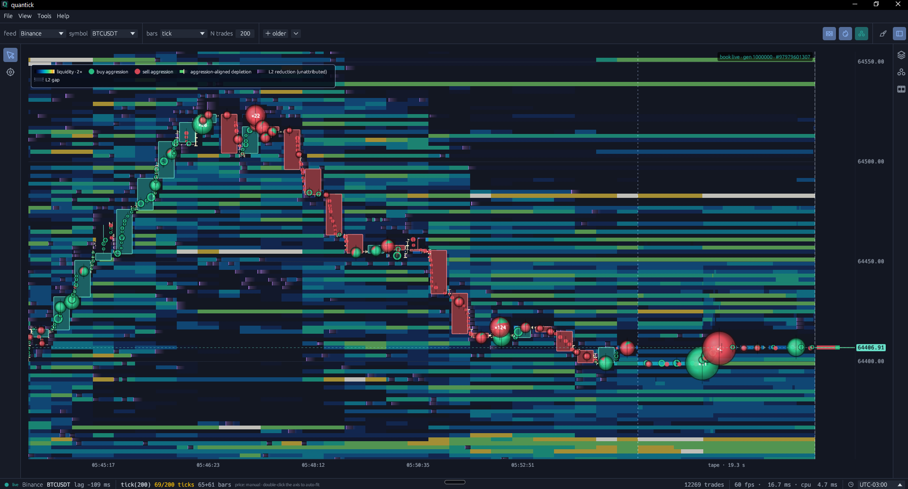

<p align="center">
  
</p>

# quantick

**Real-time alternative bar charts for order flow trading — and one engine to take your research from chart to backtest to bot.**

<p align="center">
  
</p>

<p align="center"><em>Live BTCUSDT tick bars over the Bookmap-inspired L2 liquidity heatmap, with buy/sell aggression bubbles, L2 reduction marks and a live lane where the forming bar's tape keeps moving — this is <code>cargo run -p quantick-app</code> out of the box.</em></p>

> ⚠️ Early development, but already runnable. The Rust bar engine, public Binance and Hyperliquid feeds, and the native desktop chart work today — you can clone, build and watch bars form in real time in a few minutes (see [Quick start](#quick-start--build-test-run)). APIs will still churn. Star/watch the repo to follow along.

## Why this exists

Time-based candles distort order flow. A 1-minute bar at the session open and a 1-minute bar during lunch look identical on your chart, yet one may contain fifty times more trading than the other. Every indicator you compute on top inherits that distortion: a delta of +500 contracts means one thing in a quiet bar and something completely different in a busy one.

The fix has been known for decades: sample by **activity** instead of time. Close a bar every N trades (tick bars), every N contracts (volume bars), every $N of notional (dollar bars), or whenever buying/selling pressure gets unusually one-sided (imbalance bars). The research literature — from Ané & Geman (2000) to López de Prado's *Advances in Financial Machine Learning* — documents why this works: activity-sampled bars have far better statistical properties, and they make flow metrics comparable from bar to bar.

**Quant funds and professional desks use these bar types every day.** But the tooling has stayed locked up: it lives inside proprietary platforms (Bookmap, ATAS, Sierra Chart, NinjaTrader) that don't expose an engine you can program against, or inside private codebases that never see daylight. If you want to watch these bars form live on a chart — and then hand the *exact same bars* to a backtest or a trading bot — there is essentially no open-source option today.

quantick exists to change that: **a free, open, programmable implementation of the charts professionals actually use, built for the community.**

## What quantick is for

1. **Visualize.** A native desktop app that renders tick, volume, dollar and imbalance bars from a live market feed — with per-bar delta and CVD built in. See the market the way flow traders read it.
2. **Research.** Study setups directly on the charts: how does absorption look on volume bars? Where does CVD diverge? Chart-driven analysis is where strategy ideas are born.
3. **Build.** The same engine that draws your chart feeds your backtests and your bots. The bars your strategy trades live are byte-identical to the bars you researched and backtested — parity by construction, not by discipline.

## Quick start — build, test, run

You don't need an exchange account, an API key or any credentials. Out of the box the chart connects to Binance's **public** market data and opens on `BTCUSDT`.

### 1. Install Rust

quantick is pure Rust. Install a recent stable toolchain with [rustup](https://rustup.rs/) — you need **Rust 1.85 or newer** (the workspace is on the 2024 edition):

```sh
# macOS / Linux
curl --proto '=https' --tlsv1.2 -sSf https://sh.rustup.rs | sh
# Windows: download and run rustup-init.exe from https://rustup.rs

rustc --version   # expect 1.85.0 or newer
```

### 2. Clone and build

```sh
git clone https://github.com/milocaetano/quantick.git
cd quantick
cargo build --workspace
```

The first build compiles every dependency and takes a few minutes; later builds are incremental and fast.

### 3. Run the tests

The engine is developed test-first and guarded by golden/snapshot tests (fixed trades in → known bars out). Run the whole suite with:

```sh
cargo test --workspace
```

### 4. Run the chart

```sh
cargo run -p quantick-app
```

A native window titled **quantick** opens, recovers the factual recent trades
available from the selected source and then streams live trades, forming bars as
they happen. From the controls bar you can switch the **bar type** live — tick,
volume, dollar, time or imbalance — and tune its parameter. For the smoothest
rendering on a busy order book, build optimized:

```sh
cargo run --release -p quantick-app
```

> The chart is a native desktop app (egui) and needs a graphical display; it won't run on a headless server. It's tested on Windows, Linux and macOS.

### 5. (Optional) Pick a different feed or symbol

Feeds and symbols are configuration, never hardcoded. For a one-off startup
selection, set `QUANTICK_DEFAULT_FEED` and `QUANTICK_DEFAULT_SYMBOL`; these
change only what opens and keep every configured feed in the selector. For
example, to open directly on Hyperliquid BTC:

```sh
QUANTICK_DEFAULT_FEED=hyperliquid \
QUANTICK_DEFAULT_SYMBOL=BTC \
cargo run --release -p quantick-app
```

For a custom catalog, point `QUANTICK_CONFIG` at a TOML file or place a
git-ignored `quantick.toml` in the working directory. These files replace the
complete built-in catalog; they are not merged with it. Start by copying
[`crates/app/config/feeds.toml`](crates/app/config/feeds.toml), then edit the
copy so Binance, Hyperliquid or MetaTrader are removed only intentionally.
The same file documents the optional MetaTrader 5 bridge, L2 heatmap toggles
and logging.

The built-in selector also includes Hyperliquid perpetuals (`BTC`, `ETH`,
`HYPE`, `SOL`, `ZEC`). They need no account or API key: select **Hyperliquid**,
pick a coin, then use the same **⚙ L2** and **⚙ bubbles** controls as Binance.
Hyperliquid's initial WebSocket response carries only a short recent-trades
recovery window, so older-history paging is disabled instead of being
reconstructed from candles.

### Contributing

Working on the code? Every change must pass the four-check verification loop (`cargo fmt --all -- --check`, `cargo clippy --workspace --all-targets -- -D warnings`, `cargo build --workspace`, `cargo test --workspace`) before commit — the same checks CI enforces. See [CONTRIBUTING.md](CONTRIBUTING.md) for the full workflow.

## Candle appearance

Open **🎨 candle** from the chart toolbar to tune candle rendering without
changing bars, feeds or order-book capture. The default **Order flow** preset
uses a low-opacity body and a strong directional outline so liquidity and
aggression remain visible.

- Presets: **Order flow**, **Glass**, **Outline only** and **Classic**.
- Independent bull/bear colours for the body fill and outline.
- Body fill opacity, outline opacity/thickness, body width, corner radius and
  minimum doji height.
- Optional wicks with directional or custom colour, opacity and thickness.
- A forming-candle opacity control.
- **Outline only** removes the candle body fill entirely; this is the clearest
  mode for dense heatmaps.
- Canvas background and grid can be recoloured, faded or disabled independently.

The settings window includes a live preview. Candle paint is intentionally
layered after resting liquidity and before aggression bubbles:
`heatmap → candle → aggression`. Appearance changes only trigger a redraw and
never restart the market-data pipelines.

## Market Replay

Replay a recorded session and watch the chart build it print by print, at up to
50× speed. Open it from **File → Market Replay…** (`Ctrl+R`), pick the folder
holding your sessions, choose one and press **Play session**. A transport bar
appears at the bottom of the window while a recording plays — and only then:

```
⏮ ⏸  REPLAY  WINJ26 · 2026-03-16  13:27:48   1× 2× 3× 5× 10× 20× 50×   57 650 / 86 313 prints  ✖
▬▬▬▬▬▬▬▬▬▬▬▬▬▬▬▬▬▬▬▬▬▬▬●────────────
```

`Space` toggles play/pause. Dragging or clicking the track seeks; the chart is
rebuilt from the new position, because bars that already closed cannot be
reopened. Idle stretches longer than two seconds of market time are skipped —
lunch lulls and halts do not have to be watched in real time. Playback drives
the chart through the same feed channel a live venue uses, so bars, navigation
and metrics behave exactly as they do live, and nothing is ever labelled "live"
while a recording is playing.

Replay streams trades only. Depth is not in the file, so the L2 heatmap and
aggression bubbles are unavailable during a replay and disable themselves.

### Session file format

One folder per instrument, one CSV per session day:

```text
<replay folder>/
    WINJ26/
        20260316.csv
        20260317.csv
```

Files named `SYMBOL-YYYYMMDD.csv` directly in the folder are read too. Each file
holds one executed trade per line, oldest first, preceded by `#` metadata:

```text
# quantick-replay 1
# symbol=WINJ26
# timezone=-03:00
# side_source=bid_ask
Date,Time,Price,Bid,Ask,Volume,Side
2026-03-16,10:01:08.000,182035,182030,182035,12,B
2026-03-16,10:01:09.250,182025,182025,182030,4,S
```

- **Required columns:** `Date`, `Time`, `Price`, `Volume`, `Side`.
- **Optional columns:** `Bid`, `Ask`, `Id`. Any other column is ignored and
  reported, so a file carrying extra data still loads.
- Columns are matched **by name**, so their order is free.
- `Date` is `YYYY-MM-DD`; `Time` is `HH:MM:SS` or `HH:MM:SS.mmm`, in the
  timezone declared by `# timezone=` (UTC when the line is absent).
- `Side` is the **aggressor**: `B` when the buyer lifted the offer, `S` when the
  seller hit the bid. `A`/`ASK`/`BID` are rejected by name — those spellings mean
  opposite sides at different vendors, and guessing would mirror the order flow.

The layout follows what replay-capable platforms already do (an instrument/day
folder tree, as in NinjaTrader's `db/replay/`), with the row format every
tick-data vendor ships. A folder that does not load says exactly why, per file,
with the fix and the whole format one click away in the browser.

### Importing recordings

MT5 order-flow recordings (NDJSON with `tick` and `book_update` events) convert
to sessions with:

```bash
cargo run -p quantick-replay --example import_mt5_ndjson -- \
    --in runtime/mt5_orderflow_20260316.ndjson \
    --out /path/to/replay
```

| Option | Default | Behavior |
| --- | --- | --- |
| `--in <file>` | — | Recording to read; repeat for several |
| `--out <folder>` | — | Replay folder to write into |
| `--symbol <name>` | all | Keep only this instrument |
| `--side-source <policy>` | `bid_ask` | `bid_ask` (position against the recorded quote, tick rule as fallback), `flags` (the broker's BUY/SELL tick flags) or `tick_rule` |
| `--spread-within-second` | off | Even out prints inside each recorded second |
| `--timezone <offset>` | from the data | Offset the rows are written in |

The run reports how often each rule decided the aggressor side — including how
often it disagreed with the broker's flags — and the policy is written into the
session's `# side_source=` line. Recordings that stamp trades to the second are
labelled `# time_resolution=1s`; `--spread-within-second` distributes prints
evenly across each second for smoother playback and marks the session
`1s_interpolated`, because those sub-second times are inferred.

### Replay environment variables

| Variable | Default | Behavior |
| --- | --- | --- |
| `QUANTICK_REPLAY_DIR` | unset | Folder the browser opens on |
| `QUANTICK_REPLAY_AUTOSTART` | unset | Set to `1` to load and play the first session in that folder on startup (same code path as clicking **Play session**) |
| `QUANTICK_REPLAY_SPEED` | `1` | Speed the autostarted session opens at |

## Optional L2 liquidity map

The chart can capture Binance Spot, Hyperliquid perpetual and MetaTrader DOM
depth and render a Bookmap-inspired liquidity map. Capture starts with any feed that can stream
depth; the map itself is **hidden by default** and shown from the chart
controls. The **⚙ L2** button docks a settings panel to
the left of the chart — the chart keeps the remaining width instead of being
covered — including a deterministic preview of every visual state, so themes
and grouping can be tuned without waiting for a rare live-book event.

The order flow splits into two independent layers, each with its own toolbar
switch and its own docked panel:

- **book heatmap** (**⚙ L2**) — resting liquidity and liquidity-response
  markers, built from the synchronized L2 depth pipeline.
- **bubbles** (**⚙ bubbles**) — confirmed aggressive executions, built from the
  aggregate-trade stream the chart already consumes.

Neither switch touches the other. Bubbles render with the map hidden (and for
providers without a depth pipeline at all), and hiding the book leaves the
bubbles running.

Both switches are display-only. Recording and drawing are separate concerns:
the depth recorder runs from the moment a depth-capable feed starts, so hiding
the map never punches a hole in the recorded book — reopen it and the whole
retained window is there, without the gap that stopping capture would leave.
While the map is hidden no projection is built and no depth geometry is drawn,
so the only cost it carries is the recording itself, bounded by the same
retention budget documented below. Capture stops only when the market changes:
a feed or symbol switch, or a replay taking the chart over.

The visualization follows a few data-honesty rules:

- History begins at the first successfully synchronized live snapshot/update sequence. Neither Binance nor Hyperliquid provides historical L2 backfill through these feeds, so candles before that point are marked as unavailable instead of being reconstructed. That stretch is marked by a single dashed line where the book begins, plus a label: it can span most of the chart, and tinting it would bury candles and bubbles that are perfectly real there.
- Depth update IDs are checked continuously. A disconnect, sequence gap or resynchronization closes the current liquidity runs, marks the affected interval with a faint fill between dashed vertical boundaries, and starts again from a fresh snapshot. Stale book state is never stretched across a gap. Interior gaps keep their fill precisely because they are narrow — an untinted sliver would read as "no resting liquidity" rather than "no data".
- Heatmap quantities are resting bid/ask amounts from the snapshot plus absolute depth updates, limited to the source's declared coverage. Hyperliquid publishes complete visible images of at most 20 levels per side; Binance's requested depth is configurable. Liquidity outside either coverage is unknown.
- A displayed band records the bucket total observed when its run opened; changes smaller than ~10% merge into the open run instead of cutting a new one. This churn-merge tolerance is a disclosed granularity choice — larger moves, appearances and full removals always cut a new run at their exact value.
- Trade bubbles are confirmed market aggression (`aggTrade` on Binance and venue-side `trades` on Hyperliquid). Their area is quantity-proportional and nearby prints can be clustered without changing total volume.
- A dark **bite** and impact ring mean an aggression and an L2 reduction were compatible in passive side, displayed price range, synchronized generation and time. This is an association, not a claim that one event caused the other.
- A violet dashed tail means displayed liquidity decreased without compatible aggression. It is deliberately called an **unattributed L2 reduction**, not a cancellation: a depth reduction can be an execution, cancellation, replacement or a combination of those events.
- Window clipping, retention boundaries, snapshots and synchronization gaps never create fake reduction markers.
- Captured history is bounded and kept in memory only. Restarting the application starts a new capture.

The chart exposes these settings:

| Setting | Default | Range / behavior |
| --- | ---: | --- |
| L2 heatmap | Hidden | Display-only; the recorder runs whenever the feed can stream depth, so reopening the map shows the whole retained window |
| Retention | 30 minutes | 1–1,440 minutes |
| Display range | Auto / 128 rows | Native, `2×`, `5×`, `10×`, `25×`, `50×`, custom multiple or adaptive-to-zoom; changing it reprojects immediately without resetting history |
| Base capture bucket | auto from price | Sized to ~`price / 65000` (1/2/5·10^k) on the first snapshot; any positive value can be set by hand. Changing the base resolution requires a fresh snapshot and resets retained L2 history |
| Theme | Bookmap | Bookmap, High contrast or Color blind |
| Brightness | `0.9` | `0.05`–`1.0` |
| Quiet liquidity curve | `1.8` | `0.25`–`2.0`; above one sinks quiet liquidity into the dark canvas so only real walls glow |
| Intensity scale | Visible P99 | Automatic visible-window P99 or a fixed full-intensity quantity |
| Aggression bubbles | Off | Own toolbar switch and own panel; records and projects without L2 depth capture |
| Bubble clustering | 200 ms | Raw, 50, 100, 200 or 500 ms |
| Bubble opacity | `0.78` | `0.05`–`1.0` |
| Largest bubble | `15 px` | `4`–`48 px`; area stays quantity-proportional |
| Liquidity response | On / 250 ms | Bite or withdrawal-tail markers with a configurable 25–1,000 ms evidence window |
| Legend | On | Explains liquidity brightness, buy/sell aggression, aligned depletion, unattributed reduction and L2 gaps |

The in-memory safety budgets are 500,000 liquidity runs (approximately 64 MiB), 100,000 aggression records, 12,000 projected visible cells/events and 700 projected bubbles. Old history is pruned and excess render primitives are dropped within those limits; the associated counters are emitted in diagnostic logs. All book state lives on a dedicated thread: the UI forwards depth events and latest-wins projection requests through a channel and only draws the newest published frame, so a dense-book projection can never block a frame. Projections rebuild at the ~220 ms depth cadence, are regrouped in a deterministic sweep and submitted in batched meshes. The paint order is `gap → heatmap → liquidity response → candle → aggression → legend`.

### L2 and logging environment variables

| Variable | Default | Behavior |
| --- | --- | --- |
| `QUANTICK_BOOK_DEPTH` | `1000` | Binance snapshot depth per side. Numeric values are clamped to `1`–`5000`; a missing or invalid value uses the default. Hyperliquid's public L2 coverage is fixed by the venue at up to 20 levels per side. |
| `QUANTICK_BOOK_AUTOSTART` | unset | Set to `1` to show the L2 map on startup without clicking the chart toggle (development/ops convenience; same code path as the toggle). Capture itself needs no flag — it runs for every depth-capable feed. |
| `QUANTICK_LOG_FORMAT` | `text` | Set to `json` for newline-delimited JSON diagnostic logs on stderr. |
| `RUST_LOG` | `quantick=info` | Standard tracing filter; for example, use `quantick=debug` for deeper diagnostics. |

JSON logs include stable fields such as `schema_version`, `event_code`, symbol, connection generation, update IDs, recovery action and health counters so synchronization and coverage gaps can be investigated without inferring state from prose.

## Who it's for

- **Flow traders** who want professional bar types without platform lock-in
- **Bot developers** who need deterministic, programmable bar construction for strategies driven by order flow
- **Quant researchers** who want reproducible activity-sampled bars for backtesting and ML feature engineering

## Architecture

The project is a Cargo workspace of small, one-way-dependent crates (`app` → `pine` → `indicators` → `engine`; `app` also on `orderbook`, `replay` and the feeds; `feed-*` → `engine` / `orderbook`). Status today:

- **Bar engine (Rust)** — ✅ raw trades in → alternative bars out; deterministic and headless, usable with no UI attached (`crates/engine`)
- **Live feeds** — ✅ Binance aggTrades + synchronized L2 (`crates/feed-binance`); ✅ Hyperliquid perpetual trades + visible L2 (`crates/feed-hyperliquid`); ✅ MetaTrader 5 via a local bridge EA (`crates/feed-mt5`)
- **Market replay** — ✅ recorded sessions played back through the live feed channel, at 1×–50× (`crates/replay`)
- **Desktop app** — ✅ native chart (egui) showing bars form in real time, with a Bookmap-inspired L2 liquidity heatmap (`crates/app`)
- **Indicators & scripting** — ✅ an indicator runtime with incremental `ta.*` kernels, and "Quantick Pine", a Pine v5 subset compiled and run in-process, plotted on the chart and readable headlessly by a backtest or bot (`crates/indicators`, `crates/pine`)
- **Bindings** — ⏳ Python bindings and a C API are planned, so the engine plugs into existing backtest stacks and bots in any language

## Design principles

1. **One engine, three consumers.** Chart, backtest and bot consume the same aggregator. Live/backtest divergence is a bug class we design out, not test out.
2. **Deterministic.** Same trades in, same bars out. Always.
3. **Data honesty.** Inferred or incomplete data is labeled, never silently patched.
4. **Small and focused.** This is not a trading platform. It builds and shows bars, and exposes them to your code. That's the job.

## Roadmap

- [x] Core bar engine (tick / volume / dollar / time bars)
- [x] Binance aggTrades feed
- [x] Hyperliquid perpetual trades and L2 feed
- [x] Desktop chart
- [x] Imbalance bars (López de Prado information-driven sampling)
- [x] MetaTrader 5 feed
- [x] Bookmap-inspired L2 liquidity heatmap (egui/glow; wgpu migration still open)
- [x] Market replay of recorded sessions (trades; depth replay still open)
- [x] CVD & delta visuals (native EMA/CVD indicators, delta histograms, order-flow series in scripts)
- [x] Scriptable indicators — "Quantick Pine", a Pine v5 subset with order-flow builtins (`delta`, `cvd`, `buy_volume`, …), drawing objects, hot reload and a persisted indicator set; see [docs/pine-dialect.md](docs/pine-dialect.md)
- [ ] Python bindings
- [ ] C API, so bots in C++ (or any language) can consume the engine

## Contributing

The whole point of this project is to open up tooling that has historically been private. Ideas, use cases and design discussion are welcome right now — [start a discussion](https://github.com/milocaetano/quantick/discussions), even before there's code to review. Ready to contribute code? See [CONTRIBUTING.md](CONTRIBUTING.md) for the workflow.

## License

MIT
