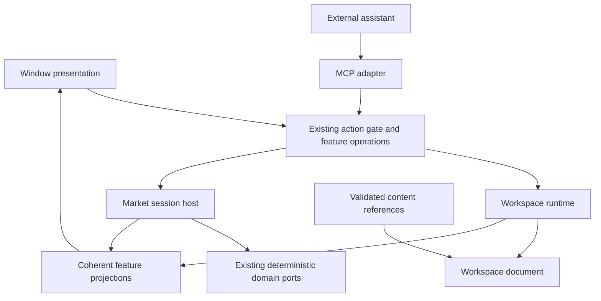

# Architecture preparation: ownership before new features

Status: proposed migration contracts; foundation planning milestone for
[#314](https://github.com/milocaetano/quantick/issues/314). No runtime extraction
is delivered by this document. Facts below were inspected at `86734896` on
2026-09-05; recheck them when an implementation task starts.

The objective is to make community appearance/content, external assistants and
window-independent workspaces possible while preserving the deterministic engine
and current behavior. The implementation sequence is in
[preparation-tasks.md](preparation-tasks.md), with evidence in
[baseline.md](baseline.md). Existing repository rules in `CLAUDE.md` and the
[control contract](../control-plane/control-contract.md) remain authoritative.
This proposal does not change the crate graph or public protocol.

## What exists, and where preparation is needed

Source links identify files; line numbers are coordinates at the audited commit.

| Boundary | Existing evidence | Preparation needed |
| --- | --- | --- |
| Domain computation | [Indicator](../../crates/indicators/src/indicator.rs), lines 105-134, already defines commit/preview; [TradingVenue](../../crates/trading/src/venue.rs), line 36, owns execution vocabulary; `crates/strategy` already contains the strategy kernel. | Keep these ports and one engine. An assistant or workspace must not introduce another computation or execution path. |
| Application/window | [QuantickApp](../../crates/app/src/app.rs), lines 181-266, describes one workspace as one window and owns tabs, IDs, chrome, style and services. | Separate document, presentation and session ownership through concrete operations. Do not move the whole root into a new `core` crate. |
| Market lifetime | [Tab](../../crates/app/src/tab.rs), lines 237-436, owns feed, replay, paper state and panes. [open/close](../../crates/app/src/app/tabs.rs), lines 125-211, spawns and drops that lifetime; close calls the paper-session close path. | A future presentation move cannot be implemented as close/reopen. Keep one session per tab initially; sharing is a separate change. |
| Scheduling | [drain_tabs](../../crates/app/src/app/tabs.rs), lines 245-265, drains hidden tabs each frame. [feed drain](../../crates/app/src/tab/feed.rs), lines 361-490 and 605-633, preserves trade processing order and batches indicator publication; depth is budgeted. | Measure fairness and minimized-window behavior before changing scheduling. An unbounded-until-empty trade drain is a measurement target, not a measured defect. |
| Workspace storage | [WorkspaceStore](../../crates/app/src/workspace_store.rs), lines 459-551, owns persistence bookkeeping, not a headless workspace runtime. [persisted Workspace](../../crates/app/src/ui_state.rs), line 372, mixes arrangement and window settings. | Separate capture models without breaking legacy files or confusing runtime ownership with persistence ownership. |
| Portable stores | [COCKPIT_STORES](../../crates/app/src/store_home.rs), line 94, and [workspace bundles](../../crates/app/src/workspace_bundle.rs), lines 110-232, already compose and validate stores. | Reuse the registry. Preserve installation-local exclusions and paper exclusion. Do not promise atomicity across all final file renames: only each rename is atomic. |
| Actions | [ActionHandler](../../crates/app/src/control/actions.rs), line 64, receives all of `QuantickApp`; [invoke_local_action](../../crates/app/src/control/gateway.rs), line 835, already unifies origins and records results. | Narrow feature dependencies behind the existing registry. A second command bus would duplicate an existing answer. |
| Readback | [ProjectionRegistry](../../crates/app/src/control/registry.rs), line 77, uses app-wide projectors, with coherent capture and off-thread serialization. | Project feature-owned values while preserving capture coherence and revision semantics. |
| Script lifecycle | [attach](../../crates/app/src/control/script.rs), lines 199-237, compiles with structured errors; [indicator manager](../../crates/app/src/app/indicator_manager.rs), lines 83-127, shares the attach path and tracks owner-qualified slots. | Preserve operator provenance and exclusion from saved layouts. Saving/adopting source into the library is a later explicit capability, not an incidental side effect. |
| Appearance | [theme](../../crates/app/src/theme.rs), line 24 onward, fixes chrome tokens; [ChartStyle](../../crates/app/src/style.rs), line 474, covers candles/canvas; [indicator style](../../crates/app/src/indicator_style.rs), lines 29 and 109, preserves sparse user overrides over authored color. | Define resolved appearance and provenance before an installable theme format. |
| Built-in extension | [surfaces](../../crates/app/src/surfaces/mod.rs), lines 70, 197, 319 and 347, already use restricted input/output and a typed registry; [drawings](../../crates/app/src/drawings/mod.rs), lines 442 and 1110, register built-ins. | These are internal Rust ports, not a downloadable community plugin ABI. Retain their useful contracts. |
| Layer identity | [ChartLayer](../../crates/app/src/chart_layers.rs), lines 80 and 191, is a closed enum/list; [layer wiring](../../crates/app/src/app/chart_layers_wiring.rs), line 181, derives mask bits from ordering. | Audit stable identity separately from ordinal storage before extending a registry. Do not reorder persisted bits as cleanup. |

PRs #310 and #311 already grouped application and pane fields by owner; #311
also moved bar parameters into their variant. Their
[app](../../.claude/GOAL-archive-app-fields-by-owner.md) and
[pane](../../.claude/GOAL-archive-pane-field-groups.md) mission records explain the
limits: grouping was deliberate, not full service encapsulation. Further work
must reduce actual dependencies, not merely split more files.

## Target responsibilities

These are conceptual owners, not a promise of one new crate per row.
Document ownership also does not consolidate the existing registered stores into
one monolithic file; preserve their adapters and file compatibility.

| Owner | Owns | Must not own |
| --- | --- | --- |
| Domain crates | Bars, books, indicator kernels, strategy state machines and venue vocabulary | Window IDs, theme parsing, assistant providers or UI clocks |
| Market session host | Feed/worker lifetime, ordered ingestion, replay generation and the current paper-session relationship | Desktop placement and drag gestures |
| Workspace runtime | Stable membership and references to current sessions, pane arrangements and content bindings | Implicit feed termination when a view is moved |
| Workspace document | Serializable arrangement, styles/overrides, content references and compatibility version | Tokens, sockets, worker handles, live orders or machine-local paths |
| Window presentation | Native window identity/geometry, DPI, gestures, active workspace view and rendering resources | Sole lifetime authority over market sessions |
| Feature operation owner | Validated typed mutations and feature readback, using only necessary dependencies | Arbitrary access to application state or a second authorization policy |
| Persistence adapter | File I/O, migration, installation-local settings and explicit save outcomes | Per-frame full-document serialization |
| Content library/catalogue | Content identity, source/provenance, compatibility and authored defaults | Automatic trading grants or cloud credentials |
| External assistant | Provider integration, conversation, speech and bounded client orchestration | Direct access to Rust internals or a bypass around MCP consent |

The diagram shows data/operation flow, not Cargo dependencies. Network and clocks
retain their existing allowed ownership. No extracted module may introduce a
reverse crate edge. A crate extraction is earned only when its headless API has
real independent consumers and complies with the existing guards.

## Contracts to settle before extraction

### Workspace, view and session lifetime

The future Chrome-like workspace tab denotes a workspace document/runtime,
not today's indicator-layout tab. Existing market tabs and layouts keep their
current meaning and persistence during preparation. Whether multiple views of
one workspace can coexist is deferred; moving one view does not imply cloning it.

| Transition | Required distinction |
| --- | --- |
| Select/deactivate view | Change presentation focus; continue current background ingestion. |
| Move/rebind view (future) | Retain session, pane and content identity; no close, reconnect, reset or new paper fill. |
| Close market session | Preserve current explicit paper close/journal and worker shutdown behavior. |
| Replace replay timeline | Preserve current reset/disarm behavior; never use this to move a view. |
| Close window / process shutdown | Initially preserve current behavior. Future multiwindow work must define last-owner shutdown explicitly before changing it. |

First expose these distinctions under one window. Do not change feed cardinality,
introduce process-per-window, or share tapes as part of a mechanical move.
Session sharing later needs an identity including feed, symbol, live/replay
generation and timeline semantics; the same ticker is insufficient. Independent
paper accounts and differing aggregation specs must remain distinct.

### Identity and compatibility

Inventory IDs before creating more: live tab/pane IDs, positional `PaneSide`,
`TabSlot`, layout IDs and persisted drawing addresses have different lifetimes.
The current [script detach input](../../crates/app/src/control/script.rs), line 98,
contains a numeric slot while slots are allocated per pane. Owner-qualified
addressing must be tested with collisions before multiwindow support. Do not
silently reinterpret v1 inputs to implement a new identity scheme.

Resolve focus to a concrete target once at the existing request boundary, retain
the owner-qualified target through the operation, and report a removed target
explicitly. Any wire extension follows the control contract's compatibility
rules and generated schema tests. Portable content references must distinguish
identity, display name, source and version; today's script filename reference
does not guarantee a template can be imported on another machine.

### Authority and operations

Keep `ActionOrigin`, actor provenance, request validation, event recording and
the pre-dispatch permission/deadline recheck. The live host currently rejects
dry runs, idempotency keys and expected revisions
([prepare](../../crates/app/src/control/contract.rs), line 1367). Generic/fake
contract support is not proof of live retry safety. Do not advertise automatic
retries for mutations until implemented and tested as separate work.

Trade scope remains denied by default and filtered from the access panel.
Moving an operation behind a smaller context must not widen that scope. Voice
and broker integration remain later product tasks using the existing venue and
control vocabulary. The open-source kernel remains focused; the paid assistant
is an external extension boundary, not a dependency added to domain crates.

Use one existing indicator operation as the first vertical extraction. Keep
validation and dispatch in the current gateway; put typed state mutation behind
a feature-owned context. Test invalid compilation, ownership and readback. Only
generalize a port when a second concrete consumer demonstrates the need.

### Content and appearance

Four mechanisms remain distinct: trusted compiled Rust extensions; Pine source;
declarative themes/templates; external MCP processes. No native ABI, arbitrary
dynamic code loader or marketplace is required to prepare these boundaries.
Rust trait objects are not a sandbox; source-size and queue limits are not
preemption. Audit execution budgets before promising safe untrusted workloads.

A theme supplies semantic defaults for chrome, chart, candles, footprint,
volume profile, drawing tools, indicators, typography and dimensions. A template
combines arrangement and content references. Both are future data products;
foundation work only establishes ownership and resolved-value contracts.

Appearance resolution distinguishes inherited defaults, authored Pine colors
and explicit user overrides. Defaults can flow from product to theme to template
to local settings, but an authored literal is not an inherited default. Existing
authored/user choices survive; clearing an override explicitly restores inheritance.
Default changes affect new objects or inheriting properties, not fixed user colors.
Provenance/error states retain readable non-color cues.

Resolve on settings/content revision changes. Rendering consumes prepared values
without token-name lookup or file I/O per candle. Font resources and platform
scaling remain presentation-side; color resolution cannot affect bar computation.

## Coordination and evidence

Three independent read-only agents audited workspace/lifecycle, extensions/style
and control/operations. Their findings converge on the existing registry and
owner-group refactors as foundations. The integrated source evidence is above;
the measurements and limitations are in the baseline. No audit agent modified
the shared worktree. Runtime writers will each receive a separate worktree.

Open work checked on 2026-09-05: #306 (`feat/trades-bars-b3`) overlaps app/frame,
tab/feed and engine vocabulary; re-audit after merge before lifecycle extraction.
#313 changes `replay_get_data.rs`; retain its download-lifetime behavior during
future session work. Existing issues #134 and #155 describe performance concerns;
their titles are investigation pointers, not fresh performance measurements.
Issue #273 concerns a native feed adapter protocol; it is not an existing plugin SDK.

The trader supplied a Claude artifact URL, but the browser tool could not open
it. No contents were inspected. The textual requirement is detachable/rejoinable
workspace tabs like Chrome; unseen styling and interaction details are not assumed.

Success is demonstrated by narrow dependencies, preserved behavior, meaningful
port tests, migration compatibility and measured runtime evidence. A smaller
file, a new trait or a favorable agent opinion alone is not evidence of readiness.
