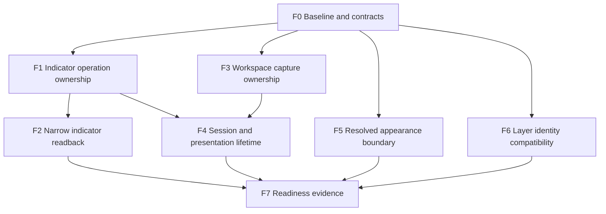

# Architecture preparation tasks

Status: executable follow-up specifications, not delivered runtime changes.
Parent: [foundation milestone #314](https://github.com/milocaetano/quantick/issues/314).
Read [foundation](foundation.md) for contracts and [baseline](baseline.md) before
starting. Every implementation task starts from refreshed main, checks live
writers/open PRs, owns a worktree and moves its tests with its owner.

No task here implements theme installation, a marketplace, voice, broker trading
or detached-window UI. Those features start after the relevant preparation gate.

## Dependency order and parallel work

F0 is this docs milestone. Start F1 first to prove the approach on existing
behavior. F3 can run independently after its ownership boundary is settled; do
not let both writers modify root construction or indicator bookkeeping together.
F5 is suitable for another lane once files/interfaces are reserved. F6 starts
with an audit and changes dispatch only if a demonstrated growth point earns it.
F4 waits for F1/F3 and a recheck of #306/#313. F7 integrates evidence; it does not
grant permission to ship the deferred product features.

Each task below is a proposed issue body. Create its issue when scheduled,
link dependencies and use its stable F-number; do not open competing tasks for
already active work. The coordinator reserves files, reviews interfaces before
delegation and serializes overlapping commits. Tests/builds and before/after
measurements are not run concurrently on the same target or benchmark host.

## F1 - Own existing indicator mutations behind a narrow context

**Priority:** first runtime PR. **Depends on:** F0.

**Problem:** the current action handler and manager can access the entire app,
although slot ownership and mutation need a much smaller set of dependencies.
The existing UI and MCP attach paths already converge; preserve that convergence.

**Scope:** `app/indicator_manager.rs`, the existing indicator state owner,
`control/script.rs`, the mirroring boundary in `app/layout_wiring.rs` and directly
affected tests. Introduce an internal typed
operation context taking only the target pane/indicator host and required slot
bookkeeping. Keep UI selection, file picking and gateway consent in their current
adapters. Keep `ActionRegistry` dispatch and all wire schemas unchanged.
Use existing attach/detach behavior; do not add save/adopt, plugins or a new bus.
Human changes also update the layout and mirror onto its other panes. Keep that
orchestration in the adapter through a typed result or a narrow collaboration
interface; preserve its ordering and exactly-once dirty marking. A target pane
alone is insufficient to reproduce this behavior.

**Steps for the assigned agent:**

1. Refresh main and inspect open overlapping PRs; read the local rules and
   `new-extension` if the proposed seam introduces a new port.
2. Enumerate each field read/written by attach/detach and the origin paths into it.
   Capture existing tests and the current schema catalogue before editing.
3. Move mutation/ownership logic into the smallest context supported by that list.
   Keep an adapter on `QuantickApp`; the core operation must not receive it.
4. Preserve whole-target identity internally. Inventory duplicate numeric slots
   without silently changing legacy detach semantics; report any existing defect
   separately with a versioned compatibility proposal.
5. Run focused tests, the four checks and the applicable review gates. Declare
   actual changed files and dependency reduction, not a target line-count claim.

**Acceptance proof:** existing UI and remote attach use the same extracted
implementation; invalid Pine leaves slots/layouts unchanged; operator detach
cannot delete a human-owned slot; operator overlays remain excluded from saved
layouts. Human attach/remove across two panes sharing a layout still mirrors
and saves exactly once. Add a port-level test with fake dependencies if a port is introduced,
and exercise that same production implementation. Catalogue/schema snapshot
tests remain identical. No new root field solely for this feature.

**Performance:** rare command path, but compile/attach may run in a UI dispatch.
No new per-trade/per-frame work. Run the existing dense-control baseline and
measure representative attach latency if the extraction changes compilation or
queueing. Do not claim a bounded queue bounds one handler's execution time.

**Fallback:** if a narrow context requires rewriting layout/session ownership,
stop that expansion, document the concrete dependency and split a prerequisite.
Do not hand the context `&mut QuantickApp` under another name.

## F2 - Project indicator state from its owner

**Priority:** P1. **Depends on:** F1.

**Scope:** the existing indicator semantic projection and its contribution to
the shared analysis revision in
`control/analysis.rs` and its registry wiring. First enumerate exact borrowed
inputs; form an owned feature snapshot during the existing coherent capture.
Keep registry discovery, permission checks and off-thread serialization.

**Acceptance proof:** byte-equivalent existing semantic output for fixed
fixtures; preserve the shared arrangement/configuration revision, including its
drawing contribution. Indicator add/remove/input/visibility/declaration/failure
and drawing edits advance it; a new bar reading alone does not. Test drawing
edits and unchanged arrangement with new readings explicitly. Capture does not retain
app references across serialization. Run schema/catalogue and permission tests.
A fake owner or fixture exercises the projection without an entire window.

**Performance:** on-demand capture with existing time counters. First add/reuse
deterministic access-mode harness setup, because the existing manual benchmark
does not toggle modes. Compare control
disabled, enabled-idle and representative requested snapshots; report capture
time and serialized size. Do not add permanent per-frame snapshots or JSON cloning.

## F3 - Separate workspace document capture from installation and window state

**Priority:** P1. **Depends on:** F0.

**Scope:** `ui_state.rs`, `workspace_store.rs`, workspace capture/restore and bundle
adapters. Inventory each persisted field as document, installation, window or
runtime-only before moving it. Extract capture/restore transformations and
encapsulate mutation/save intent; continue using `COCKPIT_STORES` and real loaders.
Keep the current on-disk version and file locations unless compatibility cannot
be maintained; in that case specify a migration as a separate explicit change.

**Acceptance proof:** existing export/import and invalid-import tests remain;
pure transformation tests preserve layout indicators, drawings and explicit
styles. Installation paths/recent files and paper state do not leak into portable
content. Unknown versions remain protected from overwrite, unknown sections
retain the existing explicit skip behavior, and failed validation changes no
stores. Preserve and report the final multi-file rename limitation.
Dirty/revision changes and save intent cannot diverge through the new API.

**Performance:** cold import/restore and event-driven/debounced save. Maintain
cached metadata; no full serialization or filesystem reads per frame. Preserve
debounce and exit-flush tests in `workspace_store.rs`.

## F4 - Separate market lifetime from presentation membership

**Priority:** P2. **Depends on:** F1, F3 and current overlap recheck.

**Scope:** tab lifecycle, workspace membership and the single-window host wiring.
Introduce an explicit internal owner/handle for session lifetime and owner-qualified
resource addresses where needed. Keep current one-feed-per-tab cardinality,
scheduler and paper behavior. Do not extract all of `ChartPane` or replace all
IDs at once. A headless ownership transfer test prepares the boundary; no drag UI.

**Acceptance proof:** rebind presentation membership without feed restart,
indicator loss, timeline reset or paper close. Explicit session close still
closes/journals once and ends worker loops. Hidden tabs continue ingesting;
batch indicator publication and simulator -> pane -> strategy order remain.
Two panes with equal local slot numbers cannot be confused by the new internal
API; removal/stale target/focus change is explicit. Keep legacy wire behavior
behind its adapter; a wire change is a versioned follow-up, not an incidental fix.

**Performance:** per-trade and per-depth ingestion, per-frame scheduling and
cold adoption/shutdown are touched. Collect the full relevant baseline first,
including hidden/minimized cases. Retain trade/depth continuity; no silent drops,
new global lock, per-trade trait allocation or extra tape clone. Test worker
counts and unchanged feed startup count for ownership moves.

**Defer:** shared tape storage, session deduplication, multiple native windows and
new last-window shutdown behavior. Measure memory cardinality before choosing
sharing; separate sessions may intentionally have different replay/account state.

## F5 - Introduce resolved appearance ownership without changing visuals

**Priority:** P2; independent of F1/F3 after file reservation. **Depends on:** F0.

**Scope:** `theme.rs`, `style.rs`, `indicator_style.rs` and their presentation
consumers. Inventory chrome/chart/drawing/profile/footprint/indicator defaults
and typography first. Introduce a resolved-value boundary around a bounded first
slice, preserving every existing default and sparse override rule. Expand in
small PRs; no installer, new theme design or external font loading in preparation.

**Acceptance proof:** default values match current behavior, explicit user and
Pine-authored colors survive changes to inherited defaults, and clearing a local
override returns to inheritance. Existing numeric sanitization stays intact.
Default screenshot/semantic comparisons cover touched surfaces. Bar and indicator
computation fixtures remain unchanged. Any new port gets a second implementation
test; it can be a fake resolver, not a new end-user theme.

**Performance:** resolution only on relevant revisions; frame/candle paths read
resolved values. No per-candle string lookup, configuration parsing or new
unbounded allocations. Run applicable visual/UX/harness gates even if intended
appearance is unchanged, because rendering consumers are touched.

## F6 - Stabilize layer identity before extending registry behavior

**Priority:** P2. **Depends on:** F0; coordinate with F5 layer consumers.

**Scope:** catalogue all layer IDs, persistence bits and availability/dispatch
consumers. First add or identify compatibility tests for existing encodings.
Only isolate descriptor metadata/read/apply at a proven extension pressure point;
do not replace every exhaustive enum or typed registry as a blanket rule.

**Acceptance proof:** all current IDs, persisted masks, ordering and unavailable
reasons survive fixtures. If a descriptor port is warranted, a fake second
descriptor docks without a root field or duplicate discovery table. Record the
files still required to add a layer and why each edit remains.

**Performance:** bounded per-frame traversal and on-demand discovery. Preserve
direct hot drawing paths; dynamic metadata must not impose per-trade dispatch.
If the audit finds no justified change, deliver evidence and close the task as
an audited decision, not as a claimed registry refactor.

## F7 - Publish readiness evidence and feature prerequisites

**Priority:** P3. **Depends on:** F2, F4, F5, F6.

**Scope:** integrate the final ownership map, measured baseline comparisons and
port examples after implementation, refreshing every claim against the shipped
revision. Reuse existing Indicator, TradingVenue and MCP contracts.

**Acceptance proof:** a second test consumer uses intended APIs without reaching
into `QuantickApp`; dependency/cycle guards stay green; default behavior and
legacy persistence tests pass; relevant measurements and raw logs are linked.
Record remaining coupling, exact measured regressions/variance and feature blockers.
Document supported versus unsupported retry, script-budget and identity semantics.

**Feature prerequisites:** themes/templates need content compatibility, portable
source references and transactional installation design; multiwindow needs DPI,
native lifecycle and scoped MCP discovery design; the assistant needs explicit
save/adopt and missing actions; voice/trading need authority, target confirmation
policy and retry-safe execution work. These are future issues, not hidden work
inside the architecture-preparation tasks.

## Gates for every implementation task

The mandatory four-check loop and reviews come from `CLAUDE.md` and the mission
tier. Use a high tier for cross-cutting lifetime/authority work. Preserve generated
schemas or explicitly version changes. Any hot path requires actual before/after
evidence. New action surfaces must be callable, readable and discoverable through
the existing control plane. Keep new UI surfaces reachable by harness hooks and
run visual/UX review where applicable. A pass does not mean all future features
exist: each PR states its delivered boundary and remaining prerequisites.
