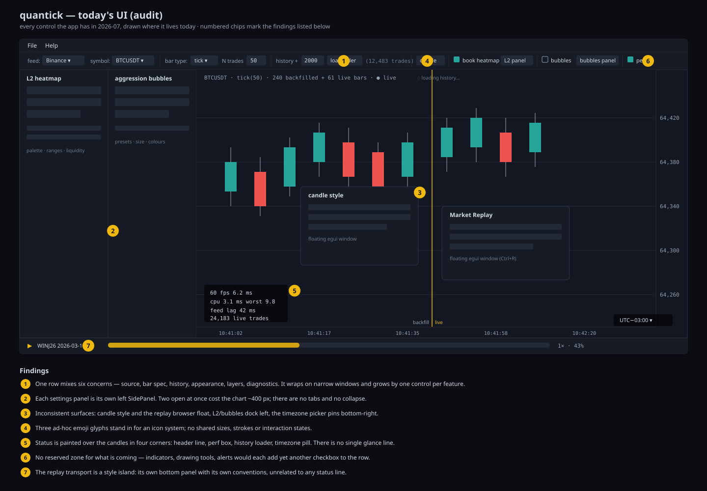
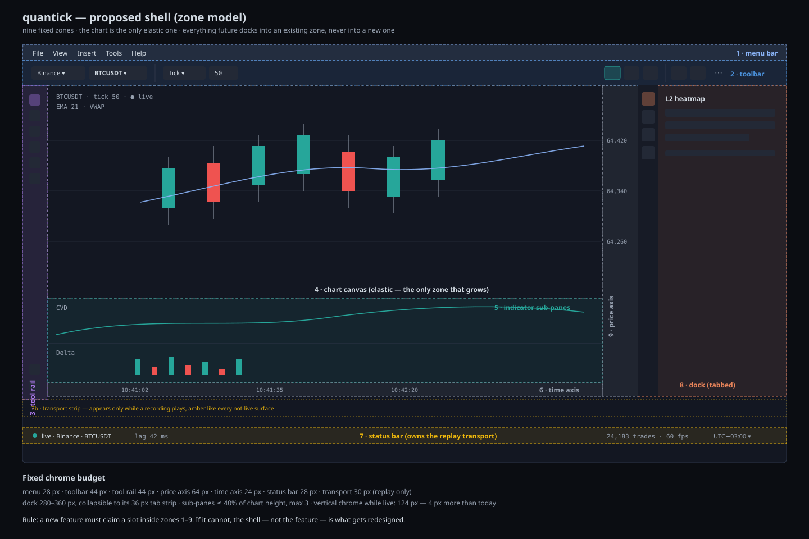
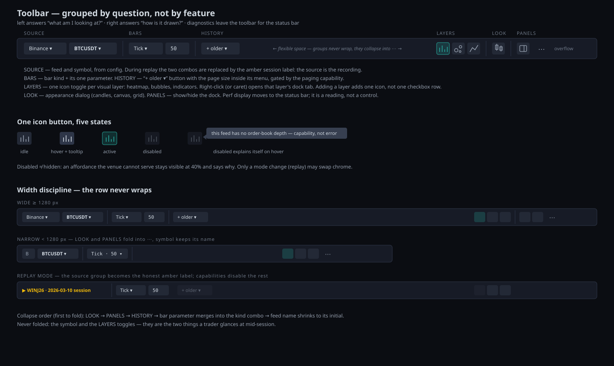
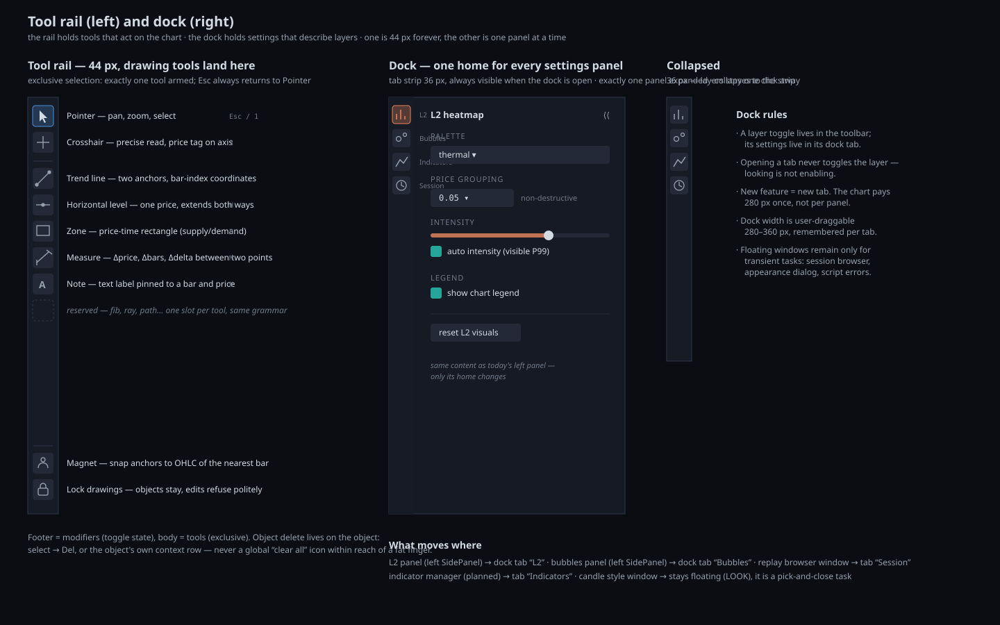
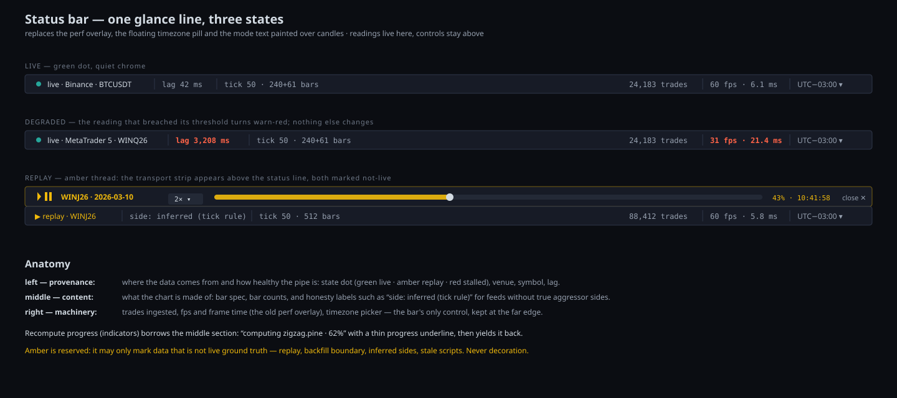
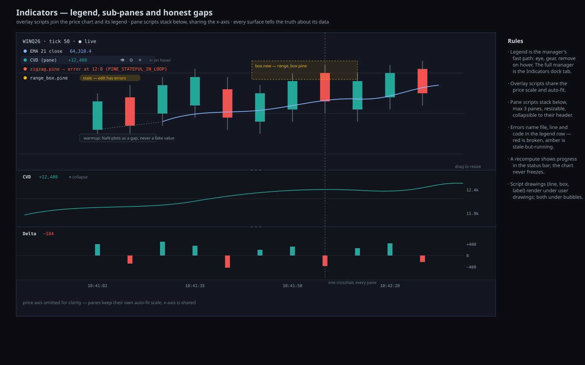

# quantick UI Design Model

Status: **implemented — migration phases 1–5** (status bar, toolbar regroup,
icon set, right dock, tool rail); phase 6 lands with the indicator milestones.
§2 documents the UI as it was *before* this model, kept as the audit record.
Scope: the desktop app's chrome — where buttons, menus, icons, panels and tools
live today, and where they will live as the app grows into indicators, drawing
tools and beyond. This document is the reference for every future UI change:
a new feature first finds its home here, then gets built.

The detailed interaction target for user-authored chart objects lives in
[Drawing tools UX specification](drawing-tools-ux-spec.html). It covers the
toolbox, non-modal inspector, selection, lock/visibility/delete semantics,
keyboard grammar, object management and the complete Fibonacci level editor.

The companion images in [`img/`](img/) are part of the spec, not decoration.
Everything in `CLAUDE.md` applies unchanged; this model adds UI placement rules
on top of it.

---

## 1. Why now

The app's UI grew feature by feature: each capability added one more control to
a single toolbar row, one more side panel, or one more floating box painted
over the candles. That was the right cost/benefit while the app was proving
its engine. Two upcoming features break the pattern:

- **Indicators** (`docs/indicator-system-plan.md`) need a manager panel,
  per-indicator settings, overlay legends, sub-panes and error surfaces.
- **Drawing tools** need an exclusive-selection tool palette and object
  editing conventions.

Bolted onto the current chrome, each would add checkboxes to an already
overloaded row and panels to an already crowded left edge. The model below
reorganizes the shell **once**, so that everything after it docks into a
reserved zone instead of inventing a new surface.

## 2. Today's UI — audit

Inventory, from code:

| Surface | Kind | Code |
|---|---|---|
| Menu bar (`File`, `Help`) | top panel | `app.rs::draw_menu_bar` |
| Controls row (feed, symbol, bar type + param, history paging, candle style button, heatmap toggle + L2 panel button, bubbles toggle + panel button, perf toggle) | top panel, one wrapped row | `app.rs::draw_controls` |
| L2 heatmap settings | **left** side panel | `orderflow_view.rs::draw_l2_panel` |
| Aggression bubbles settings | **left** side panel | `orderflow_view.rs::draw_bubbles_panel` |
| Candle style editor | floating window | `candle_view.rs::draw_style_window` |
| Market Replay browser | floating window (Ctrl+R) | `replay_view.rs::draw_browser` |
| Replay transport | bottom panel (while replaying) | `replay_view.rs::draw_transport` |
| Drawing toolbar | external 44 px rail, edge-docked | `toolrail.rs` |
| Selected-drawing inspector | floating window | `app.rs::draw_drawing_inspector` |
| Timezone picker | floating area, pinned bottom-right | `app.rs::draw_timezone_selector` |
| Header line (symbol · spec · bar counts · mode) | text painted on chart | `app.rs::draw_header` |
| Perf overlay (fps, frame ms, lag, trades) | box painted on chart | `app.rs::draw_overlay` |
| History loader | spinner painted on chart | `app.rs::draw_history_loader` |
| Backfill/live divider | amber line on chart | `app.rs::draw_backfill_divider` |

Findings (numbered in the image):

1. **The row answers six unrelated questions.** Source, bar spec, history,
   appearance, layers and diagnostics share one `horizontal_wrapped` row. It
   wraps unpredictably and grows linearly with features.
2. **Panels multiply leftward.** Every settings panel is its own
   `SidePanel::left`; two open at once cost the chart ~400 px.
3. **Four surface conventions coexist.** Docked panels, floating windows, a
   pinned area and painted overlays — with no rule for which a new feature
   should pick.
4. **No icon system.** Three ad-hoc emoji glyphs (`⟲`, `🎨`, `📈`) with no
   shared geometry or states.
5. **Status is scattered across four corners** of the canvas, occluding
   candles — there is no single line to glance at.
6. **Nothing is reserved for what is coming.** Indicators, drawings and
   alerts have no zone; each would extend findings 1–5.
7. **The transport is an island** with its own bottom-panel conventions.

What today's UI gets **right**, and the model keeps:

- Affordances gate on `FeedCapabilities`, never on provider names.
- Amber consistently marks "not live" (backfill divider, replay).
- Data text is monospace; chrome text is proportional.
- The chart owns almost the whole window; chrome is thin.

## 3. Principles

1. **The chart buys every pixel.** Fixed chrome has a budget (§5); any new
   chrome must fit an existing zone or displace something inside it.
2. **Group by question, not by feature.** *What am I looking at?* (source,
   bars) · *what is drawn on it?* (layers) · *how do I act on it?* (tools) ·
   *how healthy is it?* (status). A feature splits across groups rather than
   forming its own cluster.
3. **The amber thread.** `#F0B90B` is reserved for provenance honesty: replay,
   backfill boundary, inferred data, stale scripts. It is never decoration.
   This is the UI expression of the project's data-honesty rule — and the one
   deliberate visual signature of the app.
4. **Disabled ≠ hidden.** A capability the venue lacks renders at 40% opacity
   and explains itself on hover. Only a mode change (replay) may swap chrome.
5. **Docked is persistent, floating is transient.** Anything a trader keeps
   open while trading docks (settings, managers). Anything opened, used and
   closed floats (browsers, pickers, error details).

## 4. Design tokens

Palette — extracted from `app.rs` / `style.rs`, now named:

| Token | Value | Role |
|---|---|---|
| `bg/canvas` | `#131722` | chart canvas (user-configurable) |
| `bg/chrome` | `#171B26` | menu, toolbar, dock, status bar |
| `bg/inset` | `#10141D` | sub-panes, wells |
| `bg/control` | `#232936` | buttons, combos, inputs (also grid lines) |
| `border` | `#2E3648` | panel and control borders |
| `text/primary` | `#D2DAE2` | labels, values (today's `OVERLAY`) |
| `text/muted` | `#96A0AF` | secondary labels (today's `MUTED`) |
| `text/faint` | `#6E7887` | hints, disabled (today's `CROSSHAIR`) |
| `buy` | `#26A69A` | bull candles, buy flow, healthy/live dot |
| `sell` | `#EF5350` | bear candles, sell flow |
| `accent/overlay` | `#8AB4F8` | indicator overlay default (first plot) |
| `honest/amber` | `#F0B90B` | not-live provenance only (§3.3) |
| `warn` | `#FF6347` | threshold breaches, script errors |
| `tag/bg` | `#373F50` | tooltips, axis price tag |

Type:

- **Data is monospace** (`Consolas`/platform mono): prices, counts, times,
  lag, speeds. Sizes 10–12 px.
- **Chrome is proportional** (egui default): labels, menus, buttons. Sizes
  11–13 px.
- No third family; weight (400/600) is the only emphasis tool.

Icons (§6–§7 use them):

- 16 px glyph on a 28×28 px hit target (rail: 20 px on 30×30).
- Stroke 1.5 px, outline style; **filled/tinted = active**, outline = idle.
- States: idle `text/muted` → hover `text/primary` on `border` fill → active
  glyph in layer accent on 22% tint → disabled 40% opacity + hover
  explanation.
- Source: a vetted icon font (e.g. Phosphor via `egui-phosphor`) or in-house
  tessellated set — **no more ad-hoc emoji in chrome**. Emoji remain fine
  inside free text (menus, tooltips).

## 5. The shell — nine zones

| # | Zone | Size | Owns |
|---|---|---|---|
| 1 | Menu bar + workspace tabs | 28 px | menus left (§10); one tab per open market right (§11) |
| 2 | Context toolbar | 44 px | source · bars · history · layers · look · panels (§6) |
| 3 | Drawing toolbar | 44 px rail, edge-docked (default left) | cursor, crosshair, drawings (§7) |
| 4 | Chart canvas | elastic | candles, flow layers, overlay legends, drawings |
| 5 | Sub-panes | ≤ 40% of 4, max 3 | pane indicators: CVD, delta… (§9) |
| 6 | Time axis | 24 px | time labels, x-zoom drag |
| 7 | Status bar | 28 px (+30 transport) | provenance · content · machinery (§8) |
| 8 | Dock | 280–360 px, collapsible to 36 | tabbed settings panels (§7) |
| 9 | Price axis | 64 px | price labels, y-zoom drag |

Vertical chrome while live with the drawing toolbar on its default left
edge: 28+44+24+28 = **124 px** — a lateral rail spends horizontal budget,
not the vertical budget where price lives. Docked top or bottom it costs the
familiar 168 px, and it can be hidden from **View** or re-docked on any of
the four edges. In exchange, persistent chrome never covers the candles;
only contextual floating windows such as the selected-drawing inspector may
overlap them. Canvas layers remain limited to the legend and honest market
markers.

**The rule that keeps this stable:** a new feature must claim a slot inside
zones 1–9. If it genuinely cannot, the shell — not the feature — is what gets
redesigned, in this document first.

With the split view active (§11), zones 4, 5, 6 and 9 exist **once per chart
pane**; zones 1–3, 7 and 8 stay singular and follow the *focused* pane.

## 6. Toolbar

Left, *what am I looking at*:

- **SOURCE** — feed combo, symbol combo (from config, as today). During
  replay the group is replaced by the amber session label; you cannot pick a
  venue without closing the recording first (existing behaviour, kept).
- **BARS** — bar-kind combo + its one parameter drag (as today).
- **HISTORY** — one `+ older ▾` split button; the page size moves into its
  menu. Gated by the `history_paging` capability.

Right, *what is drawn on it*:

- **LAYERS** — one icon toggle per visual layer: heatmap, bubbles,
  indicators (future). Left-click toggles the layer; a small caret (or
  right-click) opens the layer's dock tab. **Adding a layer adds one icon**,
  not a checkbox + button pair as today.
- **LOOK** — opens the appearance dialog (candles, canvas, grid).
- **PANELS** — shows/hides the dock.
- **⋯ overflow** — collapse target; the toolbar never wraps. Collapse order:
  LOOK → PANELS → HISTORY → bar parameter merges into the kind combo → feed
  name shrinks to its initial. Never folded: the symbol and LAYERS.

Leaving the toolbar: the perf checkbox (a *reading*, moves to the status
bar §8) and both panel-opening buttons (the dock's tab strip replaces them).

## 7. Tool rail and dock

> The rail geometry, docking, button states and inspector placement are now
> specified in [drawing-toolbar-ux.md](../drawing-toolbar-ux.md), which
> supersedes the corner-docked toolbox this section used to describe. The
> detailed [Drawing tools UX specification](drawing-tools-ux-spec.html)
> stays authoritative for drawing interactions beyond the chrome:
> favourites/flyouts, the repeat pin, the Objects manager,
> lock/visibility/delete semantics, the keyboard grammar and the complete
> Fibonacci level editor.

**Drawing toolbar (external, 44 px rail).** Exclusive selection; exactly one
tool is armed and `Esc` always returns to Pointer. Its grip docks the rail
against the nearest of the four window edges — left (the default), right,
top or bottom — vertical on the lateral edges, horizontal on the others.
The panel reserves layout space, so the toolbar never floats over market
data.

| Tool | Key | Notes |
|---|---|---|
| Pointer | `Esc`/`1` | pan, zoom, select and move |
| Crosshair | `2` | hover crosshair as an armed mode |
| Horizontal line | — | one price anchor, extends across the chart |
| Rectangle | — | two corners; click-click or drag |
| Parallel channel | — | baseline plus a perpendicular width anchor |
| Fib retracement | — | two anchors and standard retracement levels |
| Fib extension | — | first leg plus projection origin |

Every drawing implementation owns its metadata, renderer and hit-test in one
module and is exposed through one static registry. Coordinates are
bar-index + price. A history prepend shifts every stored bar index by the same
net bar count as the viewport. A source or bar-spec rebuild clears the active
set rather than silently attaching anchors to different market data.

Selecting visible geometry opens per-object color, line-width, fill-opacity
and delete controls. The inspector is non-modal: dragging the visible body
moves the whole object, while dragging a white anchor edits only that point.
When the floating inspector overlaps selected geometry, that stroke or anchor
keeps pointer priority during its drag; all other clicks still edit the
inspector normally.
Closing the inspector deselects the object.

The target keeps destructive bulk actions inside the Objects manager. Lock-all
and hide-all are reversible protection/view actions; neither shares the
selected object's delete control.

**Dock (right, 280–360 px).** One tabbed panel replaces today's stack of
left `SidePanel`s: tabs **L2**, **Bubbles**, **Indicators**, **Session**.
Tab strip (36 px) stays visible when collapsed. Rules:

- A layer's *toggle* lives in the toolbar; its *settings* live in its tab.
  Opening a tab never toggles the layer — looking is not enabling.
- One tab open at a time; the chart pays the dock width once, not per panel.
- Width draggable, remembered per tab.
- Panel contents migrate as-is (palette, grouping, intensity…); only their
  home changes.
- Floating windows remain for transient tasks only: session browser (from
  the Session tab / Ctrl+R), appearance dialog, script error details.

Why right, when today's panels are left: the rail claims the left edge
(tools want to be near the pointer's resting side), settings are read-mostly,
and the dock sits beyond the price axis where the eye rarely travels
mid-trade.

## 8. Status bar and transport

One 28 px line, three sections, replacing the perf overlay, the floating
timezone pill and the mode text painted over candles:

- **Left — provenance:** state dot (green live · amber replay · red stalled),
  venue, symbol, feed lag.
- **Middle — content:** bar spec, bar counts (`240+61 bars` keeps today's
  backfilled+live split), honesty labels such as `side: inferred (tick rule)`
  for feeds without true aggressor sides (the MT5/B3 case). Indicator
  recompute progress borrows this section, then yields it back.
- **Right — machinery:** trades ingested, fps + frame time, timezone picker
  (the bar's only control, kept at the far edge).

A reading that breaches its threshold turns `warn` — the layout never moves.
While a recording plays, the **transport strip** (30 px) appears directly
above the status line: play/pause, speed, seek bar, session label, close —
all amber-marked. The transport is thus part of the status system, not an
island.

The chart canvas keeps only: overlay legend (§9), the amber backfill divider,
the history-loading spinner, and the L2 connection badge — things that mark
*positions or data on the chart itself*.

## 9. Indicator surfaces

Where the indicator plan (`docs/indicator-system-plan.md` §4) meets the
shell:

- **Legend (chart overlay, top-left)** — one row per active indicator:
  colour dot, short title, last value; eye / gear / remove appear on hover.
  Red row = script error (file:line + code, click for details); amber row =
  `stale — edit has errors` (last good version still running). The legend is
  the *fast path*; the full manager is the **Indicators dock tab** (add,
  reorder, library browser, input settings generated from `InputSpec`).
- **Sub-panes** — pane indicators stack between chart and time axis: own
  auto-fit y-scale, shared x-axis, shared crosshair. Max 3; draggable
  dividers; a pane collapses to its header. Pane headers carry name + live
  value + collapse chevron.
- **Honest gaps** — warmup NaN renders as a gap in the plot, never a
  fabricated value. This is a rendering *rule*, stated here so no future
  "fix" interpolates it away.
- **Insert menu** — `Insert → Indicator…` (opens the dock tab),
  `Insert → EMA / CVD / …` for natives. Drawing tools also list under
  `Insert` with their shortcuts, mirroring the rail.
- **Paint order** (extends the contract in `candle_view.rs`): heatmap →
  grid → script draw-objects → candles → overlay plots → user drawings →
  bubbles → legend/badges. Scripts draw under user drawings; both under
  bubbles — execution evidence always wins.

## 10. Menus and shortcuts

Menus stay shallow; they exist for discoverability and shortcuts, never as
the only path:

- **File** — New Tab… (`Ctrl+T`), Close Tab (`Ctrl+W`), Market Replay…
  (`Ctrl+R`), Close Replay, Exit.
- **View** — Layout ▸ Flow / Timeframe / Timeframe + Flow (§11; what the
  canvas shows is a view concern, and the entries name the charts they
  show), dock show/hide (`Ctrl+B`), each dock tab, sub-pane collapse-all,
  perf readings on/off, timezone.
- **Insert** — indicators (natives + library), drawing tools (§9).
- **Tools** — appearance dialog, future: script library folder, alerts.
- **Help** — replay file format…, future: Pine dialect reference,
  shortcut list.

Shortcut map currently implemented:
`Esc/1` pointer · `2` crosshair · `Ctrl+R` replay browser · `Ctrl+B` dock · `Space`
play/pause while replaying · `+`/`−` replay speed · `Ctrl+T` new tab ·
`Ctrl+W` close tab · `Ctrl+Tab`/`Ctrl+Shift+Tab` cycle tabs. Single letters
stay free of modifiers (no text inputs live on the chart).

## 11. Workspace tabs and split view

Lands with the timeframe-split milestone. Two orthogonal capabilities: **tabs**
multiply markets, the **split** multiplies views of one market. Either works
without the other.

### Workspace tabs (zone 1, right of the menus)

One tab per open market. A tab chip reads `SYMBOL · venue` in chrome type,
with a close `×` on hover and a trailing `+` that opens the source picker
(feed + symbol, from the config catalog — the same catalog the toolbar's
SOURCE group reads). Zone 1 already had the horizontal room; the chrome
budget is unchanged.

- **A tab owns its market wholesale**: feed connection and channels, flow
  pane, optional time pane, drawings, indicator slots, replay link, notices,
  loading state. Nothing market-scoped lives outside a tab.
- **Switching never tears down feeds.** Background tabs keep draining their
  bounded channels every frame (a stalled channel would back the feed thread
  up); only the active tab renders.
- **Provenance follows the active tab**: status bar, side-honesty note,
  notice cards and the transport strip all read from it. A background tab
  with a dead feed shows an amber dot on its chip — honesty at a glance.
- Replay is **per-tab**: a recording opens inside the tab that requested it,
  replacing that tab's SOURCE group with the amber session label (existing
  behaviour, now scoped). Other tabs keep streaming live.
- Default open: one tab, the config default (`default_feed`/`default_symbol`).
- **The picker can add a symbol the catalog does not have.** An "Add symbol…"
  field under the symbol list opens it immediately and remembers it in
  `quantick-symbols.toml` beside the config — the config file itself is
  hand-written and never rewritten by the app. Added symbols merge into the
  catalog before it is validated, so they reach the MetaTrader port map like
  any other, and they carry the only remove affordance in the app: a shipped
  entry is the config's, not the app's. This is what a rolling B3 contract
  (WINQ26 → WINV26) needs, and it costs no file editing.
- **The last tab is not closable.** Its `×` disables itself and says why: a
  window with no market has nothing to draw, and an empty canvas is not a
  state the chrome has anything true to say about.
- **The same market may be open twice.** Two views of one book — different
  bar specs, different drawings, different indicator slots — is a legitimate
  thing to want, so nothing dedupes the strip. For MetaTrader that means two
  listeners on one mapped port, and the second loses the bind: that tab shows
  the bridge's own port-in-use notice. One port per *symbol* is what
  `[metatrader.ports]` buys; one port per tab is not on offer.
- MT5 tabs each need their own bridge port (`[metatrader.ports]` ↔ the EA's
  `InpPort`); a port collision surfaces as that tab's notice card, never as
  another tab's problem.

### Split view (per tab: zones 4–6 + 9 duplicate)

`View → Layout` (per-tab, remembered) offers three canvases, each named for
what it shows: **Flow** (the default), **Timeframe** (the time pane alone,
full window, header included) and **Timeframe + Flow**. The split canvas
divides on a draggable vertical divider — **time pane left, flow pane
right**, 50/50 default, 25% minimum each. The time pane is the *context*
view; the flow pane keeps quantick's identity. A feed may declare the canvas
its tabs open on (`default_layout` / `default_bars` in `feeds.toml`,
startup-scoped like `default_feed`); the factory default stays Flow.

- **One engine, one tape.** Both panes are fed the same trades from the
  tab's feed; the time pane is a second `ChartState` with `BarSpec::Time`.
  No second bar-building path exists.
- **Time pane header** carries an inline timeframe selector — `1m 5m 15m 1h`
  presets plus the existing custom interval drag. The toolbar's BARS group
  governs the *focused* pane — the same pane the status bar reads and
  indicator commands land on, so the chrome never disagrees with itself
  about which chart a command describes.
- **Focus follows the switch.** Changing layout focuses the pane the switch
  reveals, so the first command after it already lands on the chart that
  just appeared.
- **Flow layers stay on the flow pane.** Heatmap, bubbles and the live strip
  never render on the time pane. Indicators and drawings work on both, each
  pane owning its slots and objects (anchors are bar-index + price and do
  not translate across bar streams).
- **Focus**: clicking a pane focuses it; the focused pane drives the status
  bar's content section, `Insert → Indicator` targeting and the Indicators
  dock tab. A 1 px accent under the pane's top edge marks focus — no
  border boxes around market data.
- **The drawing chrome stays singular and follows focus.** One rail, one
  properties inspector, one object manager per window — zone 3 is singular
  by §5 — and each reads and writes the *focused* pane's objects. The
  placement rules in [drawing-toolbar-ux.md](../drawing-toolbar-ux.md) §4.2
  (open beside the selection, auto-pin on a narrow chart, re-clamp when the
  pane shrinks) measure that pane's chart rectangle, not the window's, so a
  split half is what decides whether a floating inspector still fits.
- **Venue history in front of the tape.** The time pane opens on the venue's
  own candles — ninety days of them, roughly 130 000 1-minute bars and about
  45 MB per tab, fetched once and folded locally to whatever the header asks
  for, so a chip click never reaches the network. They stand *in front of* the bars quantick cut
  from prints, never mixed into them: the engine rebuilds its own series from
  retained trades on every spec change, and a prefix living inside it would be
  eaten. Gated on `FeedCapabilities::ohlcv_history`; a recording asks for
  nothing, and an interval that is not a whole number of minutes gets no
  prefix rather than an approximated one.
- **The seam is marked.** A dashed amber rule where venue candles give way to
  bars built from prints, labelled `venue` — distinct from the solid amber
  backfill divider, which keeps marking its own boundary further right. The
  status bar's content section counts all three sources in the order they sit
  on the chart (`26000v+240+61 bars`). A block the venue cut short — it stopped
  answering, or the answer hit a cap — belongs beside that count as an amber
  mark: a chart showing six weeks where ninety days were asked for is making a
  claim about the market it cannot support. Logged today (`OHLCV_INCOMPLETE`);
  the badge is deferred rather than half-built. A *short* series is not the
  same thing — an instrument younger than the span has fewer candles, and that
  answer is complete.
- **What a venue candle is not.** It is one summary per interval, not a bar
  replayed from prints. Only Binance publishes an aggressor split, so only
  there does the prefix carry a real delta; on Hyperliquid and MetaTrader the
  volume is exact and the delta is identically zero — read as *not measured*,
  never as measured and found balanced. That zero is a *stored representation*:
  the two sides each carry half the candle's volume, so an indicator reading
  `buy_volume` directly over the prefix sees half-volumes, not a measured
  aggressor side. The mapping sites record this per provider.
- **Honest gaps**: time bars skip empty intervals (engine policy, stated in
  `crates/engine/src/time.rs`); the x-axis stays slot-indexed, so quiet
  periods compress instead of rendering fabricated empty candles. The time
  axis labels make the jump visible; nothing interpolates. The fold keeps that
  rule: an interval in which the venue reported nothing is skipped, not
  emitted flat.

## 12. Growth map

Where future features land — decided now, so they never claim new chrome:

| Future feature | Toggle/entry | Settings | Canvas presence | Status |
|---|---|---|---|---|
| Indicators (M1–M5) | LAYERS icon + Insert menu | dock tab Indicators | legend rows, overlays, sub-panes | recompute progress |
| Drawing tools | edge-docked toolbar | selected-object inspector | drawings layer | — |
| Alerts | on indicator/level context | dock tab Alerts | triggered marker on bar | armed count + last fired |
| Paper trading ([spec](paper-trading.md)) | toolbar BUY/SELL | dock tab Trading | order/position price lines | SIM P&L cell |
| Bot / strategy monitor | LAYERS icon | dock tab | order/position markers | connection + P&L cell |
| Second chart / layouts | **landed — §11** | — | split canvas per §11 | per-chart provenance |
| Watchlist | — | dock tab | — | — |

## 13. Migration plan

Each phase is one small PR, passing the four checks, shippable alone, no
engine changes anywhere. Suggested order — cheapest confidence first:

1. **Status bar** (`app/src/statusbar.rs`) — move perf readings, timezone,
   mode/counts line off the canvas; delete `draw_overlay`,
   `draw_timezone_selector`, and the header's status half. Transport strip
   restyles into it (`replay_view.rs` keeps ownership).
2. **Toolbar regroup** (`app/src/toolbar.rs`) — extract `draw_controls`,
   regroup per §6 with the overflow rule; history becomes a split button.
   No behaviour change, only placement; capability gating untouched.
3. **Icon set** — adopt the icon font/set, replace emoji glyphs, implement
   the four button states as a small widget helper (`app/src/widgets.rs`).
4. **Dock** (`app/src/dock.rs`) — tabbed right dock; migrate L2 + bubbles
   panel bodies unchanged; retire the two `SidePanel::left`s; Session tab
   hosts the replay browser entry.
5. **Tool rail skeleton** (`app/src/toolrail.rs`) — Pointer + Crosshair as
   real modes with the exclusive-selection + `Esc` grammar, reserving the
   geometry drawing tools will fill.
6. **Indicator surfaces** — land with indicator milestones M1/M4 (worker,
   legend, panes, dock tab), already knowing their home.

Phases 1–3 are pure relocation and can precede indicator M1; phase 4 should
land before the Indicators tab is needed; phase 5 anytime; phase 6 rides the
indicator plan.

## 14. Open questions

- **Persistence of chrome state** — *answered*: a sibling `ui-state.toml`,
  not a section of `indicators-state.toml`. Each store owns what nothing
  else owns (one field, one file), and this one owns the *arrangement*: the
  tab strip, each tab's canvas layout, divider, focus and bar specs, the
  dock, the rail, the timezone and the window size. Two tiers reach it —
  `Workspace → Save workspace` (Ctrl+Shift+S) on demand, and `Save on exit`,
  on by default. Restoring is filtered against the live config: a market it
  no longer offers is dropped, never resurrected. See
  `crates/app/src/ui_state.rs`.
  Still open inside it: dock body widths and sub-pane heights stay
  in-session. They are read back off egui's layout rather than owned as
  state, so giving them a home is a separate increment.
- **Multi-chart** is now specified in §11 (tabs + one split). Grid layouts
  (2×2 and beyond) and per-pane toolbars remain unspecified until a real
  need exists.
- **Themes**: tokens (§4) make a light theme *possible*; it is a non-goal
  until someone asks for one.
